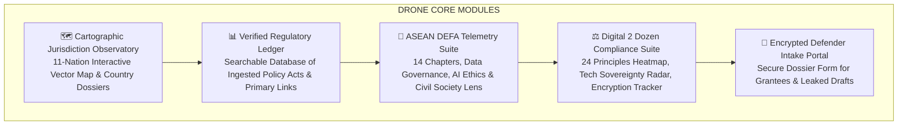

# DRONE — Digital Rights Oversight & Network Evaluator

> **Client / Organization**: [EngageMedia](https://engagemedia.org)  
> **Maintained By**: EngageMedia Research & Engineering Team  
> **Tech Stack**: Next.js 16 (App Router & Turbopack), React 19, Tailwind CSS v4, Supabase (`pgvector`), Drizzle ORM, pnpm 11  
> **License**: Creative Commons Attribution 4.0 International (CC BY 4.0) / AGPL-3.0  

---

## 🎯 The North Star Vision

> **"To serve as Southeast Asia’s premier independent digital rights early-warning system and policy observatory—bridging dense legal trade policy (ASEAN DEFA, cross-border data transfer, AI governance) and civil society campaign advocacy before bills become law."**

The **DRONE** platform transitions civil society from reactive commentary to proactive policy defense. By translating obscure regulatory language, technical trade jargon, and algorithmic policies into visually engaging, source-verified intelligence, DRONE equips regional activists, human rights defenders, independent journalists, and grantees across 11 Southeast Asian nations.

---

## 🛠️ Core Utility & Key Capabilities



### 1. 🗺️ Cartographic Jurisdiction Observatory (`/observatory`)
* **11 ASEAN Member States Covered**: Indonesia (ID), Malaysia (MY), Singapore (SG), Philippines (PH), Thailand (TH), Vietnam (VN), Cambodia (KH), Laos (LA), Myanmar (MM), Brunei (BN), and Timor-Leste (TL).
* **Precise Vector SVG Map**: Rendered dynamically using real Natural Earth GeoJSON (`public/data/southeast-asia.json`) via `d3-geo`.
* **Regime Classification Filters**: Filter by data flow posture (*Open Transfer Regime*, *Hybrid / Selective Public Localization*, *Strict Data Localization*).
* **Country Dossier Inspection Profiles**: Interactive modal revealing data localization mandates, active ingested decrees, civil society threat impact scores, and direct primary gazette links.

### 2. 📊 Verified Regulatory Ledger & Registry (`/ledger`)
* **100% Primary Source Citation**: Every policy recap item links directly to primary legal texts or official regulatory gazettes (Kominfo ID, IMDA SG, ETDA TH, DICT PH, MIC VN, ASEAN Secretariat).
* **High-Density Data Table**: Filter by topic category (*DEFA*, *Cross-Border Data*, *AI Governance*, *Cybersecurity*), threat level (`[High Alert]`, `[Medium Risk]`, `[Rights Verified]`), or search keyword.

### 3. 📜 ASEAN DEFA Telemetry Suite (`/defa`)
* **5 Dedicated Oversight Modules**: Track 14 negotiation chapters, cross-border data transfer rules, AI ethics guidelines, e-payments/cybersecurity, and civil society threat assessments.

### 4. ⚖️ Digital 2 Dozen Benchmark (`/d2d`)
* **24-Principle Compliance Heatmap**: Score matrix mapping 11 jurisdictions against international digital trade principles.
* **Specialized Telemetry**: Technology sovereignty radar, encryption & backdoor event timeline, and consumer protection monitors.

### 5. 🚨 Encrypted Defender Intake Portal (`/intake`)
* **Secure Intake Queue**: Allows regional researchers, journalists, and frontline activists to submit leaked draft texts or policy alerts.

---

## 🗺️ Developer Cheat Sheet: Where Does What Live?

| If you want to change / update... | Location | Backing Technology |
| :--- | :--- | :--- |
| **Curated Links & Articles** | [Airtable CMS](https://airtable.com/appu4obXmSR8kzkYx) | Airtable API (Instant local dev / 1h ISR prod) |
| **Policies & Threat Alerts** | `/admin/policies` or Supabase Dashboard | Supabase PostgreSQL (`policies` table) |
| **Investigations & Dispatches** | `/admin/news` or Supabase Dashboard | Supabase PostgreSQL (`news` table) |
| **Digital 2 Dozen Matrix** | `src/lib/digital2dozen.ts` & `benchmarkData.ts` | Static TypeScript research dataset |
| **DEFA Chapter Telemetry** | `src/services/defa.ts` | Static treaty matrix & analysis |
| **Cartography & Regional Map** | `src/components/observatory/AseanMap.tsx` | D3-Geo + Natural Earth GeoJSON (`public/data/`) |
| **Branding Colors & Themes** | `src/lib/colors.ts` & `src/app/globals.css` | Official ASEAN Palette Tokens |
| **All Domain Types** | `src/types` (e.g. `import type { ... } from "@/types"`) | Universal TypeScript Barrel |

---

## 📁 Repository Documentation (`docs/`)

The repository maintains an authoritative, living documentation suite:

* 📄 **[`AGENTS.md`](./AGENTS.md)** — **Mandatory AI & Maintainer Guardrails (Branding, ASEAN color tokens, map rules, typography)**
* 📄 **[`docs/ARCHITECTURE.md`](./docs/ARCHITECTURE.md)** — Three-Tier Data Architecture, Next.js App Router layout, and caching
* 📄 **[`docs/design/DESIGN_SYSTEM.md`](./docs/design/DESIGN_SYSTEM.md)** — ASEAN logo palette tokens, typography rules, contrast standards, and editorial voice
* 📄 **[`docs/MAINTAINER_GUIDE.md`](./docs/MAINTAINER_GUIDE.md)** — Maintainer hygiene standards & cognitive load reduction guide
* 📂 **[`docs/specs/`](./docs/specs/)** — Active feature specifications (`defa-suite.md`, `digital-2-dozen.md`, `content-ingester.md`, `cartography.md`)

---

## 💻 Quickstart & Local Development

### Prerequisites
- **Node.js**: `v20+` (or `v24+`)
- **Package Manager**: **`pnpm 11`**

```bash
# Clone the repository
git clone https://github.com/okihita/drone.git
cd drone

# Install dependencies
pnpm install

# Start local development server (Turbopack)
pnpm dev
```

Open [http://localhost:3000](http://localhost:3000) in your browser.

### Quality Assurance & Linting

```bash
# Full unified verification (Vitest + ESLint + Colors + Typography + Links)
pnpm run check

# Comprehensive linter suite
pnpm run lint

# Run unit tests only
pnpm test

# Production build test
pnpm run build
```

---

### Author & Organization Credits
* **Organization**: [EngageMedia](https://engagemedia.org)
* **Maintained By**: EngageMedia Research & Engineering Team
* **License**: Released under the Creative Commons Attribution 4.0 International License (CC BY 4.0).
