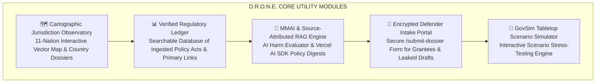

# D.R.O.N.E. — ASEAN Digital Rights Oversight & Network Evaluator

> **Client / Organization**: EngageMedia  
> **Maintained By**: EngageMedia Research Team  
> **Tech Stack**: Next.js 16 (App Router & Turbopack), React 19, Tailwind CSS v4, Supabase (`pgvector`), Drizzle ORM, Vercel AI SDK v4  
> **License**: Creative Commons Attribution 4.0 International (CC BY 4.0) / AGPL-3.0  

---

## 🎯 The North Star Vision

> **"To serve as Southeast Asia’s premier independent digital rights early-warning system and policy observatory—bridging dense legal trade policy (ASEAN DEFA, cross-border data transfer, AI governance) and civil society campaign advocacy before bills become law."**

The **D.R.O.N.E.** platform transitions civil society from reactive commentary to proactive policy defense. By translating obscure regulatory language, technical trade jargon, and algorithmic policies into visually engaging, source-verified intelligence, D.R.O.N.E. equips regional activists, human rights defenders, independent journalists, and grantees across 11 Southeast Asian nations.

---

## 🛠️ Core Utility & Key Capabilities



### 1. 🗺️ Cartographic Jurisdiction Observatory (`/observatory`)
* **11 ASEAN Member States Covered**: Indonesia (ID), Malaysia (MY), Singapore (SG), Philippines (PH), Thailand (TH), Vietnam (VN), Cambodia (KH), Laos (LA), Myanmar (MM), Brunei (BN), and Timor-Leste (TL).
* **Precise Vector SVG Map**: High-precision SVG landmass boundary rendering.
* **Regime Classification Filters**: Filter by data flow posture (*Open Transfer Regime*, *Hybrid / Selective Public Localization*, *Strict Data Localization*).
* **Country Dossier Inspection Profiles**: Interactive modal revealing data localization mandates, active ingested decrees, civil society threat impact scores (1 to 5), and direct primary gazette links.

### 2. 📊 Verified Regulatory Ledger & Registry (`/ledger`)
* **100% Primary Source Citation**: Every policy recap item links directly to primary legal texts or official regulatory gazettes (Kominfo ID, IMDA SG, ETDA TH, DICT PH, MIC VN, ASEAN Secretariat).
* **High-Density Data Table**: Filter by topic category (*DEFA*, *Cross-Border Data*, *AI Governance*, *Cybersecurity*), threat level (`[High Alert]`, `[Medium Risk]`, `[Rights Verified]`), or search keyword.

### 3. 🤖 MMAI & Source-Attributed RAG Engine
* **Media Monitoring of Alleged AI Incidents (MMAI)**: Rule-based decision-tree evaluator that scores reported automated harm incidents, distinguishing algorithmic bias from human error.
* **Source-Attributed RAG Pipeline**: Powered by **Vercel AI SDK v4**, Gemini 1.5 Pro, and Claude 3.5 Sonnet over Supabase `pgvector` embeddings to generate 3-minute executive summaries with direct hyperlinked legal quotes.

### 4. 🚨 Encrypted Defender Intake Portal (`/intake`)
* **Secure Intake Queue**: Allows regional researchers, journalists, and frontline activists to submit leaked draft texts or policy alerts.
* **Flexible Attribution**: Public Credit, Co-Branded Partner, or Anonymous Defender Protection.

### 5. 🧪 GovSim Scenario Simulator (`/govsim`)
* **Tabletop Policy Stress-Testing**: Interactive scenario rehearsal module allowing civil society teams to model "what-if" policy outcomes against existing ASEAN laws.

### 6. 🌐 Multilingual Accessibility & Editorial Design System
* **13 Regional Languages**: Built-in dropdown supporting English, Bahasa Indonesia, Tagalog (Filipino), Thai, Vietnamese, Khmer, Burmese, Lao, Bahasa Melayu, Portuguese, Tetun, Traditional Chinese, and Simplified Chinese.
* **Editorial Journalism Styling**: Light Mode default with system preference detection (`prefers-color-scheme`) and interactive `ThemeToggle` (Light / Dark / System). Uses `Newsreader` serif and `Inter` sans-serif fonts.

---

## 📁 Repository Documentation Suite (`docs/`)

All background research, benchmarking analyses, strategic frameworks, engineering roadmaps, and repository guardrails are stored in [`docs/`](file:///Users/okihita/WebstormProjects/drone/docs):

* 📄 **[docs/AGENT_GUARDRAILS.md](file:///Users/okihita/WebstormProjects/drone/docs/AGENT_GUARDRAILS.md)** — **Mandatory AI & Codebase Guardrails (Monospace forbidden, attribution rules, theme defaults)**
* 📄 **[docs/analysis/01_Reference_Analysis_and_Findings.md](file:///Users/okihita/WebstormProjects/drone/docs/analysis/01_Reference_Analysis_and_Findings.md)**
* 📄 **[docs/analysis/02_ASEAN_Policy_Hub_Design_and_Strategy.md](file:///Users/okihita/WebstormProjects/drone/docs/analysis/02_ASEAN_Policy_Hub_Design_and_Strategy.md)**
* 📄 **[docs/analysis/03_ASEAN_DEFA_Research_Report.md](file:///Users/okihita/WebstormProjects/drone/docs/analysis/03_ASEAN_DEFA_Research_Report.md)**
* 📄 **[docs/implementation/01_Web_App_Sprint_Roadmap.md](file:///Users/okihita/WebstormProjects/drone/docs/implementation/01_Web_App_Sprint_Roadmap.md)**
* 📄 **[docs/implementation/02_Content_Branding_and_Socials_Strategy.md](file:///Users/okihita/WebstormProjects/drone/docs/implementation/02_Content_Branding_and_Socials_Strategy.md)**
* 📄 **[docs/implementation/03_Project_Branding_Plan.md](file:///Users/okihita/WebstormProjects/drone/docs/implementation/03_Project_Branding_Plan.md)**

---

## 🗓️ 6-Sprint Engineering Roadmap (Months 1 to 6)

| Sprint | Timeline | Core Focus | Primary Technical Deliverable (2026 Tech Stack) |
| :--- | :--- | :--- | :--- |
| **Sprint 1** | Month 1 | Platform Scaffolding & Map | Next.js 16 + React 19 + Tailwind v4, SVG ASEAN map, 13-language UI, ThemeToggle |
| **Sprint 2** | Month 2 | Database & Scraping Fleet | Supabase PostgreSQL + Drizzle ORM (`pgvector`), Python Scrapy/Playwright crawler fleet |
| **Sprint 3** | Month 3 | Translation & RAG Engine | Neural Translation API, Entity Classifier, Vercel AI SDK Vector RAG API |
| **Sprint 4** | Month 4 | Weekly Recap & HITL Portal | Auto-recap generator, `/admin` editor dashboard, `@react-pdf/renderer` & Resend |
| **Sprint 5** | Month 5 | Community Submission | Secure `/submit-dossier` form, grantee moderation queue, partner profiles |
| **Sprint 6** | Month 6 | Campaign & GovSim Engine | Graphic generator, Cinemata video embeds, `/govsim` tabletop module |

---

## 💻 Quickstart & Local Development

```bash
cd ~/WebstormProjects/drone
npm install
npm run dev
```

Open [http://localhost:3000](http://localhost:3000) in your browser.

---

### Author & Organization Credits
* **Organization**: [EngageMedia](https://engagemedia.org)
* **Maintained By**: EngageMedia Research Team
* **License**: Released under the Creative Commons Attribution 4.0 International License (CC BY 4.0).
