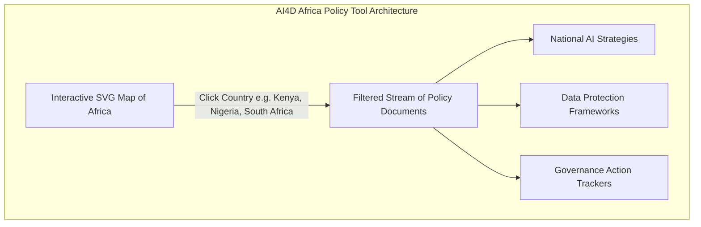
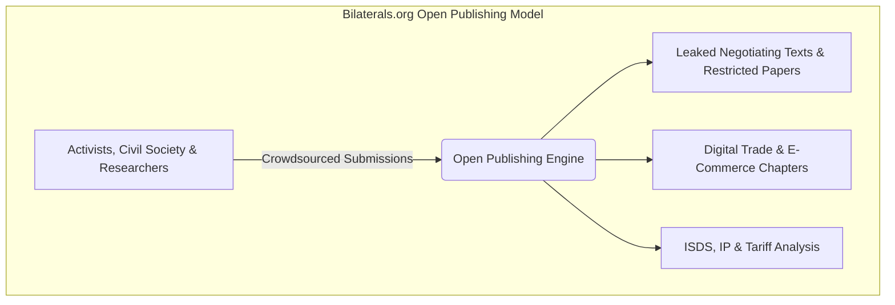
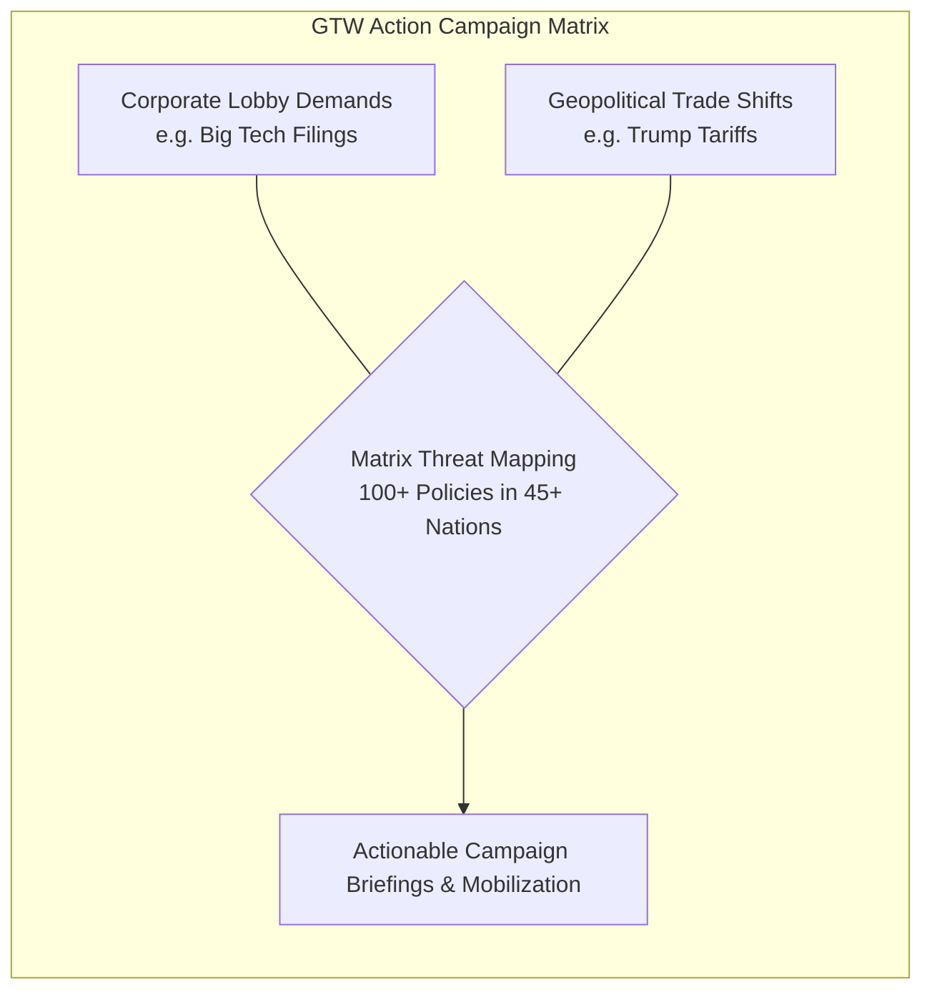
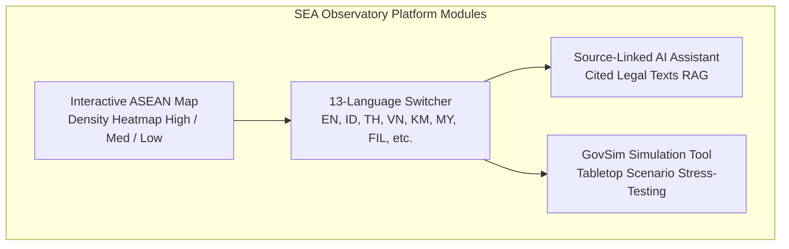
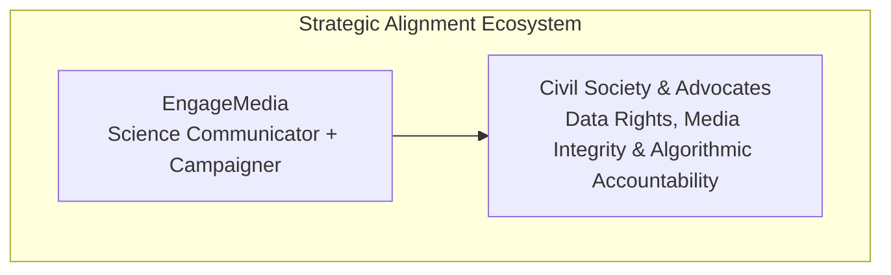

# Reference Benchmarking & Analysis: ASEAN Policy Hub Portal

> **Author**: Okihita  
> **Date**: July 2026  
> **Target Project**: EngageMedia ASEAN Policy Hub Feasibility & Design Study  
> **Status**: Completed Benchmarking Report  

---

## 1. Executive Summary

To evaluate the feasibility and architectural design of EngageMedia's proposed **ASEAN Policy Hub**, we conducted an in-depth benchmarking analysis of five key international digital policy portals and watchdog platforms. These reference platforms represent distinct models of policy tracking, community participation, AI integration, and advocacy storytelling:

1. **AI4D Africa Policy Tool** (*African Observatory on Responsible AI / Research ICT Africa*)
2. **Bilaterals.org** (*Global Open-Publishing Trade Watchdog*)
3. **Public Citizen’s Global Trade Watch / Rethink Trade** (*gtwaction.org*)
4. **SEA Observatory** (*seaobservatory.org*)
5. **EngageMedia Ecosystem & Strategic Context**

Each platform offers unique strengths, visual features, and operational workflows. This document details the feature set, user experience, content structure, and the **"coolest parts"** of each reference model, concluding with a comparative matrix to inform EngageMedia’s platform blueprint.

---

## 2. In-Depth Analysis of Reference Platforms

---

### Reference 1: AI4D Africa Policy Tool & Research ICT Africa
* **URLs**: [ai4d.ai/africa-policy-tool](https://www.ai4d.ai/africa-policy-tool) | [researchictafrica.net](https://researchictafrica.net/project/ai-in-africa-policy-project-ai4d/)
* **Focus**: Responsible AI Governance, National AI Strategies, and Policy Mapping across the African Continent.

#### Key Features
1. **Interactive SVG Geographic Filter**: A vector-rendered continent map of Africa allowing users to select individual nations to instantaneously filter policy records.
2. **Categorized Policy Taxonomy**: Standardized tagging for National AI Strategies, Data Protection Regulations, Ethical Frameworks, and Sector-Specific AI Guidelines.
3. **Comparative Peer-Learning Structure**: Designed to help policymakers and researchers compare how neighboring countries structure their AI governance.
4. **Research ICT Africa Integration**: Direct linkages between high-level policy papers, academic research, and real-time policy tracking.

#### The "Coolest Part"
* **Seamless Continental-to-National Map UX**: The interactive SVG map provides an immediate visual representation of policy density across the continent. Clicking a country updates the policy feed without full page reloads, making geographic policy navigation fluid and intuitive.
* **Global South Alignment**: It explicitly highlights indigenous and Global South governance priorities rather than merely replicating Western frameworks.

---

### Reference 2: Bilaterals.org
* **URL**: [bilaterals.org](https://bilaterals.org/)
* **Focus**: Activist Watchdog for Bilateral Trade Agreements, Digital Trade Chapters, Free Trade Agreements (FTAs), and Investment Treaties.

#### Key Features
1. **Open Publishing Model**: Grassroots activists, NGOs, and researchers around the world can directly submit articles, leaked text snippets, policy analyses, and news updates.
2. **Watchdog Document Vault**: Acts as an unofficial public repository for restricted or leaked negotiation texts (e.g., e-commerce negotiations, digital trade chapters, investment agreements).
3. **Multi-Language Aggregation**: Aggregates trade updates across English, Spanish, French, and local regional languages.
4. **Granular Topic Tagging**: Deep categorizations covering Digital Trade, Cross-Border Data Flows, Source Code Disclosures, Intellectual Property, and ISDS (Investor-State Dispute Settlement).

#### The "Coolest Part"
* **Community-Powered Open Publishing Architecture**: Bilaterals.org functions as a decentralized, activist-driven intelligence network. It solves the issue of centralized editorial bottlenecks by allowing regional civil society groups to upload documents and news directly, turning the platform into an indispensable watchdog repository.

---

### Reference 3: Global Trade Watch (Public Citizen / GTW Action)
* **URL**: [gtwaction.org/mapping-big-techs-global-deregulatory-demands](https://gtwaction.org/mapping-big-techs-global-deregulatory-demands-for-the-trump-trade-agenda/)
* **Focus**: Campaign-Oriented Threat Mapping, Tracking Big Tech Deregulatory Demands & Trade Policy Counter-Campaigns.

#### Key Features
1. **Matrix Policy Threat Mapping**: Maps tech corporation lobby demands (e.g., Big Tech trade association filings) directly against national public-interest regulations across 45+ jurisdictions.
2. **Campaign-Driven Storytelling**: Frames dense trade legalism into urgent, campaignable narrative briefs suitable for advocacy, press, and public mobilization.
3. **Geopolitical Contextualization**: Connects high-level trade shifts (e.g., US tariffs, executive orders, bilateral pressure) directly to domestic regulatory debates.

#### The "Coolest Part"
* **Corporate Lobby vs. Domestic Regulation Counter-Matrix**: The platform doesn't just list laws—it explicitly exposes *which big tech lobbying group is trying to dismantle which domestic law*. This adversarial policy mapping is immensely powerful for civil society advocacy and campaign strategy.

---

### Reference 4: SEA Observatory
* **URL**: [seaobservatory.org](https://www.seaobservatory.org/en/explore)
* **Focus**: AI Governance Intelligence, Multilingual RAG Assistant, and Scenario Simulation across 11 Southeast Asian Jurisdictions.

#### Key Features
1. **Next.js Modern Architecture**: Blazing-fast responsive platform built with dynamic client-side state, modern web typography, and glassmorphic UI elements.
2. **13-Language Regional Localization**: Native language switching across English, Traditional/Simplified Chinese, Bahasa Indonesia, Khmer, Burmese, Filipino, Lao, Bahasa Melayu, Portuguese, Tetun, Thai, and Vietnamese.
3. **Activity Density Map**: Map legend indicating regulatory intensity across 11 Southeast Asian jurisdictions + ASEAN-level regional instruments.
4. **Source-Citing AI Assistant**: Natural language RAG assistant that returns answers with direct hyperlink citations back to primary legal source documents.
5. **GovSim (Decision Rehearsal Module)**: Tabletop scenario simulator allowing policy teams to stress-test regulatory proposals against existing legal frameworks.

#### The "Coolest Part"
* **GovSim + Source-Linked AI RAG Engine**: SEA Observatory represents the cutting edge of AI-integrated policy portals. The combination of an **AI Assistant that never invents answers (strict primary source citation)** and **GovSim (scenario stress-testing)** transforms a passive repository into an active policy lab.

---

### Reference 5: EngageMedia Strategic Context
* **Client**: [EngageMedia](https://engagemedia.org) (Digital Rights, Open Tech, Video for Change, Science Communication, Campaign Strategy)

#### Key Takeaways for EngageMedia
* **Role Alignment**: EngageMedia is positioned not merely as an academic think tank, but as a **science communicator and campaign strategist**. The Hub must translate legal jargon into actionable media, infographics, and campaign briefs.
* **Strategic Priorities**: Demands algorithmic accountability, data privacy, challenging corporate tech power, defending online civic space in Southeast Asia, regional democratic resilience, human-rights-centered AI governance, and capacity building.

---

## 3. Comparative Matrix Across Reference Platforms

| Feature / Dimension | AI4D Africa Policy Tool | Bilaterals.org | Global Trade Watch | SEA Observatory | **Proposed EngageMedia Hub** |
| :--- | :--- | :--- | :--- | :--- | :--- |
| **Primary Focus** | AI & Data Policy in Africa | Global Bilateral Trade & FTAs | Big Tech Lobbying & Trade Threats | ASEAN AI Governance | **ASEAN Digital Rights, AI & Trade Hub** |
| **Visual Mapping** | Interactive SVG Map | None (Text / Categorized Feed) | Policy Matrix & Briefings | Interactive Density Map | **Interactive ASEAN Policy Heatmap** |
| **Content Delivery** | Policy Document Repository | Grassroots Open Publishing | High-Impact Campaign Briefs | Document Index + RAG | **Weekly AI Recaps + Visual Storytelling** |
| **AI Integration** | None | None | None | RAG Assistant + GovSim | **Automated Multi-lingual Fetch & Summarizer** |
| **Community Role** | Research Consumers | Active Contributors (Uploads) | Campaign Advocates | Institutional Testers | **Grantees & Network Co-Creation** |
| **Target Audience** | Policymakers & Academics | Activists & Trade Watchdogs | Press, Campaigners, Lawmakers | Regulators & Tech Firms | **Civil Society, Grantees, Press, Public** |

---

## 4. Benchmark Synthesis & Key Recommendations

From this benchmarking analysis, EngageMedia can extract five critical design principles:

1. **Adopt SEA Observatory's Tech Rigor**: Use modern web architecture, interactive mapping, and a source-verified AI pipeline.
2. **Incorporate Bilaterals.org's Open Submissions**: Create a grantee/partner submission portal so regional activists can submit local policy alerts.
3. **Emulate Global Trade Watch's Campaign Storytelling**: Translate complex policy developments (e.g., ASEAN DEFA, Trump Tariffs, cross-border data restrictions) into clear campaign briefs and visual summaries.
4. **Utilize AI4D's Geographic Focus**: Tailor taxonomy strictly to ASEAN regional nuances and Global South digital rights priorities.
5. **Fulfill Strategic Digital Rights Goals**: Center all features around defending civic space, tracking Big Tech pressure, and democratizing access to policy intelligence for Southeast Asian advocates.
