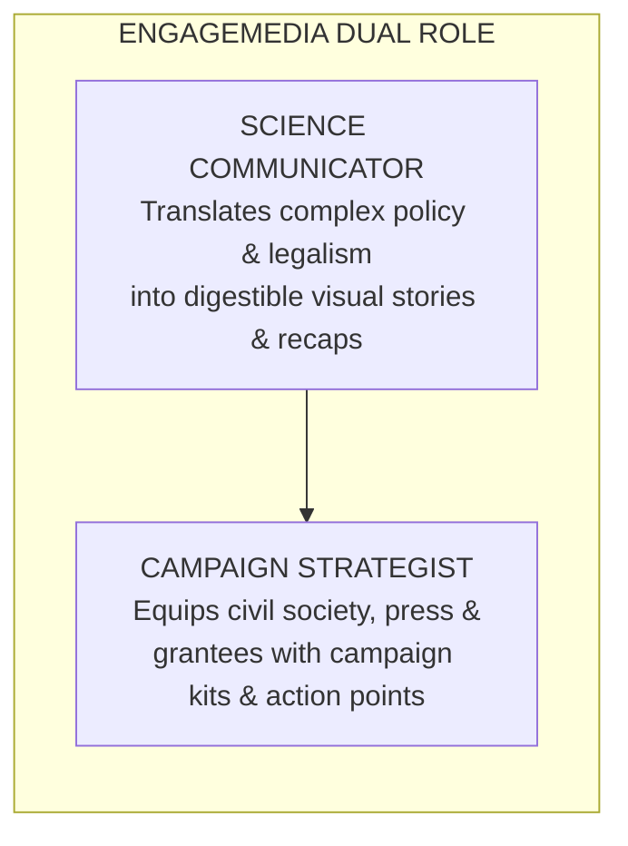
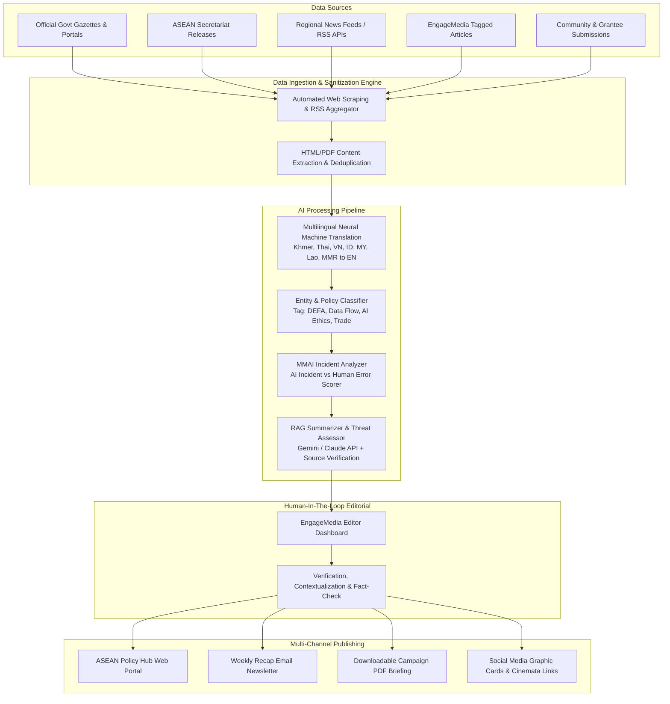
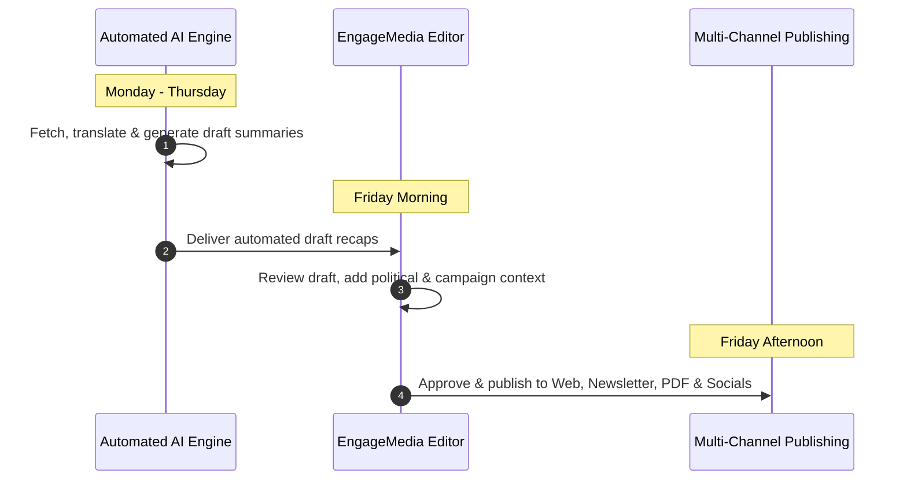
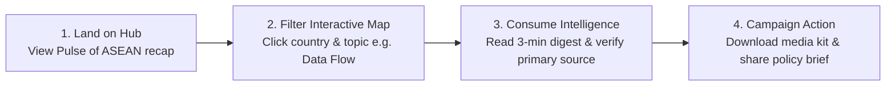
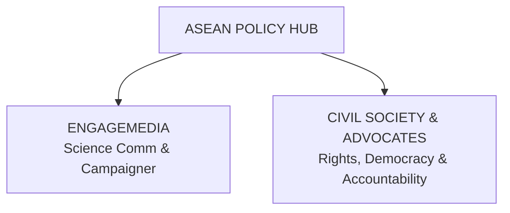
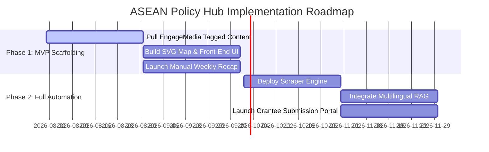

# EngageMedia ASEAN Policy Hub: Technical Architecture, Feature Design, & Strategic Narrative

> **Author**: Okihita  
> **Date**: July 2026  
> **Target Project**: ASEAN Policy Hub Portal — Feasibility Study, AI Pipeline & Strategic Alignment  
> **Status**: Approved Implementation & Design Blueprint  

---

## 1. Executive Blueprint & Strategic Positioning

### 1.1 Project Vision
The **EngageMedia ASEAN Policy Hub** is conceived as a dynamic, open-access intelligence portal and advocacy campaign center. It monitors, synthesizes, and visualizes rapid policy developments, trade agreements, AI frameworks, and digital rights laws across the 10 ASEAN Member States (plus Timor-Leste) and ASEAN-level regional bodies.

### 1.2 EngageMedia’s Strategic Positioning: *Science Communicator & Campaign Strategist*
Rather than functioning purely as an academic legal database, EngageMedia positions itself as a **Science Communicator and Campaign Strategist**. 

### 1.3 Key Policy Focus Areas
1. **ASEAN Digital Economy Framework Agreement (DEFA / DEVA)**: Cross-border e-commerce, digital trade rules, and regulatory harmonization.
2. **Cross-Border Data Flows & Data Sovereignty**: Personal data protection laws (PDPA/GDPR equivalents), localization requirements, and surveillance regimes.
3. **AI Governance & Algorithmic Impact (MMAI)**: AI policy, ethical frameworks, distinguishing AI incidents from human error, and algorithmic harms.
4. **Geopolitical Trade & Tariff Shifts**: Impact of international trade agendas (e.g., US tariffs, Big Tech deregulatory demands) on regional Southeast Asian digital rights.

---

## 2. Core Platform Features & User Experience (UX)

---

### Feature 1: The "Pulse of ASEAN" Weekly Policy Recap Engine
* **Purpose**: Provide a high-value, scannable weekly summary of major policy shifts across ASEAN.
* **UX Design**:
  * **Interactive Timeline Slider**: Scroll through historical weekly recaps.
  * **Categorized Threat/Opportunity Badges**: Tags for `[High Impact]`, `[Digital Rights Alert]`, `[Trade Shift]`, `[AI Governance]`.
  * **Executive 3-Minute Digest**: Bulleted key takeaways designed for busy activists, journalists, and policy leads.
  * **Multi-Format Distribution**: One-click export to PDF briefing, newsletter format, RSS feed, and downloadable social media graphic cards.

---

### Feature 2: Interactive ASEAN Policy & Threat Map
* **Purpose**: Provide immediate geographic and thematic navigation across all Southeast Asian nations.
* **UX Design**:
  * **Vector SVG Map**: Clickable map covering Indonesia, Malaysia, Philippines, Thailand, Vietnam, Singapore, Cambodia, Laos, Myanmar, Brunei, and Timor-Leste.
  * **Density Heatmap & Status Filtering**: Filter by policy maturity (Enacted, Draft, Consultation, Under Review).
  * **Country Profiles**: Clicking a country opens a dedicated panel showing:
    * Current Digital Rights Health Index
    * Active Laws & Pending Bills
    * Recent Weekly Recap Stories
    * Local Partner & Community Contributions

---

### Feature 3: Community Submission & Open Publishing Pipeline ("Civil Society Co-Creation")
* **Purpose**: Inspired by *Bilaterals.org*, leverage EngageMedia's extensive regional network and grantees to report local policy alerts.
* **UX Design**:
  * **Encrypted/Secure Submission Form**: Allows grantees, local activists, and researchers to submit news, draft bills, or localized analysis.
  * **Editorial Moderation Queue**: Internal review workflow for EngageMedia editors before public release.
  * **Attribution Options**: Flexible credit options (Public Attribution, Partner Co-branding, or Anonymous Defender Protection).

---

### Feature 4: Campaign & Science Communication Toolbox
* **Purpose**: Empower advocates to turn policy intelligence into campaign action.
* **UX Design**:
  * **Explainer Infographics**: Automatically formatted visual summaries of complex policy papers.
  * **Cinemata Video Integration**: Seamlessly embed related human rights and environmental documentaries from EngageMedia's *Cinemata* platform.
  * **Media & Campaign Kits**: Downloadable graphics, press release templates, and key messaging points for civil society campaigns.

---

## 3. Technical Architecture & AI Automation Pipeline

How can EngageMedia automatically fetch, translate, and summarize policy updates from 11 jurisdictions while ensuring 100% accuracy and zero hallucination?

### 3.1 End-to-End System Architecture Diagram

---

### 3.2 Step-by-Step AI Pipeline Breakdown

#### Step 1: Automated Multi-Source Ingestion
* **Target Sources**:
  * Official ASEAN Secretariat portals, national parliamentary gazettes, regulatory bodies (e.g., Kominfo ID, IMDA SG, ETDA TH, DICT PH).
  * Regional news outlets (The Jakarta Post, Bangkok Post, Channel NewsAsia, Vietnam News, etc.).
  * Historical EngageMedia archive tags for initial platform scaffolding.
* **Technology**: Python Scrapy / Playwright scripts + Google News API & RSS Aggregators running on scheduled cron jobs.

#### Step 2: Multilingual Translation & Sanitization
* Regional policy updates are published in local languages (Thai, Vietnamese, Bahasa Indonesia, Khmer, Lao, Burmese).
* **AI Action**: Automated translation layer utilizing neural translation models into English (and cross-translating summaries back into Bahasa Indonesia/Thai) while preserving original text for verification.

#### Step 3: Entity Classification & "MMAI" Incident Analysis
* **Policy Tagging**: Categorizes content into DEFA, Cross-Border Data, AI Governance, Surveillance, Cybercrime Law.
* **MMAI Module (Human Error vs AI Incident)**: Evaluates reported automated harm incidents against a standard decision tree:
  * *Is the harm caused by autonomous/algorithmic decision-making, or human operational misuse?*
  * Flags algorithmic harms for specialized civil society tracking.

#### Step 4: RAG-Based Summarization & Threat Scoring
* **AI Action**: Generates a structured 3-bullet executive digest, policy impact assessment, and threat score (1 to 5) for civil society.
* **Source Attribution Constraint**: Every generated summary includes hyperlinked direct quotations from the raw source document to prevent AI hallucination.

#### Step 5: Human-In-The-Loop (HITL) Editorial Review
* **Crucial Quality Gate**: No automated summary is published directly to the public without approval from an EngageMedia editor.
* Editors review the AI-generated draft on Friday mornings, add regional political context, select related *Cinemata* videos, and approve one-click publication.

---

## 4. Content Flows & User Journeys

---

### Journey A: The Weekly Recap Generation Flow (Internal Team)

---

### Journey B: The Policy Advocate / Researcher Flow (External User)

---

## 5. Strategic Alignment Narrative

How does the ASEAN Policy Hub fulfill the strategic goals of EngageMedia and Southeast Asian digital rights advocates?

### 5.1 Alignment with EngageMedia’s Mission & Vision
* **Democratizing Technical Knowledge**: Functions as a *Science Communicator*, translating dense legal code (e.g., ASEAN DEFA data provisions) into clear, visually engaging stories.
* **Empowering Campaigners**: Provides actionable campaign strategy tools, helping regional activists anticipate digital rights threats before bills become law.
* **Ecosystem Synergy**: Integrates EngageMedia’s existing media platforms, linking policy analysis directly to human rights advocacy.

### 5.2 Alignment with Digital Rights & Regional Priorities
* **Data & Digital Rights**: Direct tracking of cross-border data protection, algorithmic oversight, and corporate surveillance regimes.
* **Challenging Big Tech Power**: Exposes how international trade negotiations and Big Tech lobbies seek to deregulate digital safeguards across ASEAN.
* **Defending Online Civic Space**: Provides early warning against restrictive ICT laws, internet censorship, and state surveillance across Southeast Asia.
* **Regional Resilience**: Fosters cross-border solidarity among Southeast Asian civil society organizations navigating common digital trends.

---

## 6. Feasibility, Resource Allocation, & Implementation Roadmap

### 6.1 Phased Implementation Plan

### 6.2 Resource & Budget Allocation ($3,000 Initial Scope)

| Component | Resource Allocation | Implementation Detail |
| :--- | :--- | :--- |
| **Frontend & UX Design** | ~ $1,000 | Open-source Next.js / Tailwind stack, SVG ASEAN Map, responsive design |
| **AI Scraping & RAG Pipeline** | ~ $1,000 | Python crawler, Gemini/Claude API integration, vector embeddings |
| **Editorial & Scaffolding** | ~ $1,000 | Ingesting historical EngageMedia articles, editorial taxonomy, initial recaps |
| **Total** | **$3,000** | **Delivers a production-ready, AI-assisted ASEAN Policy Hub MVP** |

---

## 7. Summary & Next Steps

The proposed EngageMedia ASEAN Policy Hub combines the **open publishing philosophy of Bilaterals.org**, the **campaign threat matrix of Global Trade Watch**, and the **technological sophistication of SEA Observatory**. 

By serving as both a **Science Communicator** and **Campaign Strategist**, EngageMedia will provide Southeast Asia's civil society with an unprecedented tool to defend digital rights, track policy shifts, and hold power accountable across ASEAN.
