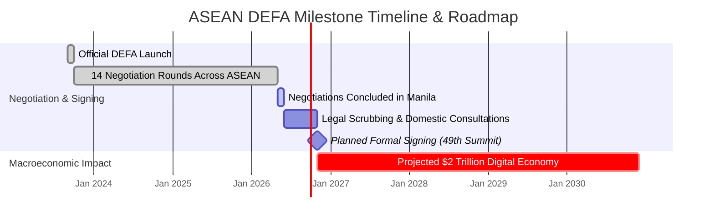
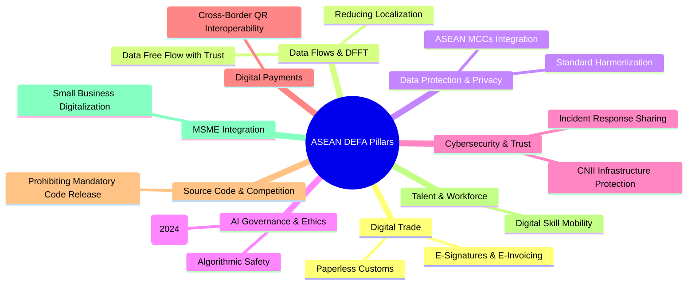
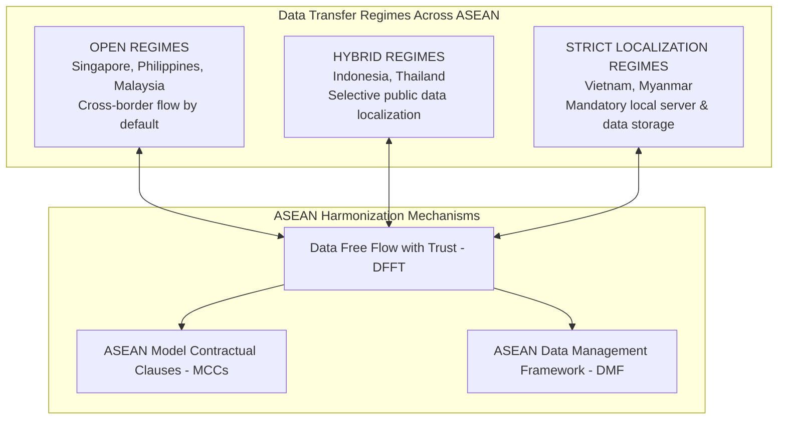
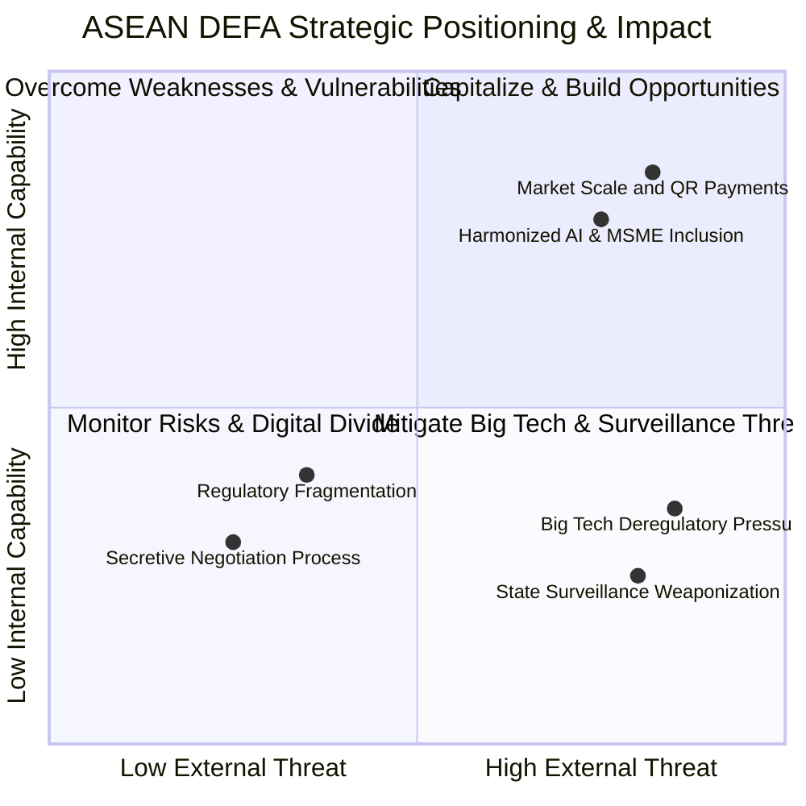
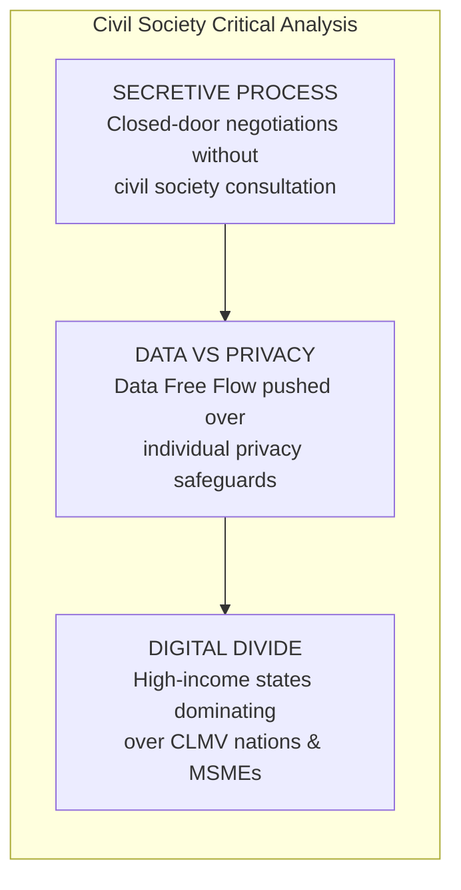

# Comprehensive Research Report: ASEAN Digital Economy Framework Agreement (DEFA)

> **Author**: Okihita  
> **Date**: July 2026  
> **Target Focus**: Policy Deep-Dive for EngageMedia ASEAN Policy Hub  
> **Status**: Expanded Strategic Research Report (Includes Deep-Dive Data Flow & SWOT Analysis)  

---

## 1. Executive Summary & Key Milestones

The **ASEAN Digital Economy Framework Agreement (DEFA)** is the world’s first region-wide, legally binding agreement dedicated exclusively to digital economy governance. Spanning all 10 ASEAN Member States (Brunei, Cambodia, Indonesia, Laos, Malaysia, Myanmar, Philippines, Singapore, Thailand, Vietnam) and paving the way for Timor-Leste’s integration, DEFA aims to harmonize digital trade rules, enable seamless cross-border data flows, and establish shared standards for emerging technologies such as Artificial Intelligence (AI).

### Key Fact Sheet
* **Current Status (July 2026)**: Negotiations officially **concluded** at the 57th Senior Economic Officials Meeting (SEOM) in Manila, Philippines (May 27–29, 2026).
* **Next Phase**: Legal scrubbing (legal review) and domestic consultation across member states.
* **Target Signing**: November 2026 at the 49th ASEAN Summit.
* **Economic Value**: Projected to double ASEAN's digital economy value from ~$300 billion in 2023 to **US$2.0 Trillion by 2030**.

---

## 2. Background & Strategic Context

### 2.1 Evolution of ASEAN Digital Policy
Historically, digital trade in Southeast Asia was fragmented across regional blueprints such as the *Bandar Seri Begawan Roadmap (2021)* and the *ASEAN Digital Integration Framework Action Plan (DIFAP)*. DEFA transitions the region from non-binding economic targets to a formal, legally enforceable treaty.

### 2.2 Geopolitical & Regional Drivers
1. **Demographic & Market Scale**: Over 680 million citizens, boasting one of the world's youngest, most digitally engaged populations.
2. **Global Power Dynamics**: ASEAN seeks to construct a unified regional digital regime to maintain digital neutrality amidst competing US (free-market tech), EU (strict GDPR/AI Act regulation), and China (state-managed data sovereignty) regulatory frameworks.

---

## 3. Core Pillars & Negotiation Chapters

DEFA encompasses nine major negotiation pillars designed to build a "trusted, secure, and seamless" regional digital market:

---

## 4. Deep-Dive: Cross-Border Data Flow Analysis

Cross-border data flow is the cornerstone of DEFA, serving as the central engine for regional e-commerce, cloud computing, and AI development. However, it represents the most politically contentious negotiation area due to diverging national policies on data sovereignty vs. digital open trade.

### 4.1 The "Data Free Flow with Trust" (DFFT) Paradigm
DEFA adopts the global **Data Free Flow with Trust (DFFT)** concept, attempting to permit free data movement while embedding "trust" mechanisms (privacy laws, cybersecurity safeguards, and regulatory exemptions for national security).

### 4.2 Regulatory Spectrum Across ASEAN Member States
ASEAN member states fall into three distinct regulatory tiers regarding data flows:

1. **Open Transfer Regimes (Singapore, Philippines, Malaysia)**:
   * Data transfers are permitted by default provided recipient organizations maintain comparable protection standards (e.g., Singapore PDPA, Philippines DPA).
   * Actively push for strict bans on data localization in DEFA.

2. **Hybrid / Conditional Regimes (Indonesia, Thailand)**:
   * *Indonesia*: Governed by Law No. 27/2022 (PDP Law) and Government Regulation PP 71/2019. Public sector electronic system operators (ESOs) are required to process and store data domestically, while private sector ESOs can transfer data abroad under contractual safeguards.
   * *Thailand*: Thai PDPA allows cross-border transfers subject to destination adequacy or standard contractual clauses.

3. **Strict Localization Regimes (Vietnam, Myanmar)**:
   * *Vietnam*: Law on Cybersecurity (Decree 53/2022) mandates foreign tech companies operating in Vietnam to store user data locally and establish branch offices if requested by law enforcement.
   * *Myanmar*: Draft Cybersecurity Law contains heavy data localization and state access provisions.

### 4.3 ASEAN Mechanisms for Data Flow Interoperability
* **ASEAN Model Contractual Clauses (MCCs)**: Voluntary template clauses approved by ASEAN Digital Ministers to facilitate legally compliant cross-border personal data transfers between businesses without requiring custom legal agreements.
* **ASEAN Data Management Framework (DMF)**: A standardized reference guide for businesses to establish internal data governance, data classification, and security lifecycle management.
* **Interoperability Challenge**: DEFA seeks to make ASEAN MCCs interoperable with international frameworks like the **APEC Cross-Border Privacy Rules (CBPR)** and the **EU General Data Protection Regulation (GDPR)**.

### 4.4 Civil Society & Rights Implications of Data Flows
* **Unchecked Commercial Exploitation**: Without strong, enforceable privacy baselines, mandatory "free flow of data" risks enabling multinational tech firms to extract regional citizen data without accountability.
* **State Surveillance & Arbitrary Requests**: Cross-border data agreements must contain explicit safeguards preventing authoritarian governments from leveraging cross-border mechanisms to demand political dissidents' data from neighboring jurisdictions.

---

## 5. Comprehensive SWOT Analysis of ASEAN DEFA

The following SWOT analysis evaluates DEFA from a multi-dimensional perspective—balancing macroeconomic benefits against civil society, digital rights, and governance challenges:

### 5.1 STRENGTHS (Internal Advantages)
1. **High-Level Political Consensus**: Overcoming 14 negotiation rounds demonstrates rare regional political will to create a unified digital market.
2. **Pre-Existing Interoperability Foundations**: Leverages existing operational successes, such as cross-border QR payment linkages and the ASEAN Model Contractual Clauses (MCCs).
3. **Massive Market Scale & Demographic Dividend**: Represents 680M+ citizens and a projected $2 Trillion digital economy by 2030, giving ASEAN substantial bargaining leverage on global tech stages.
4. **Comprehensive Scope**: Integrates digital trade, data flows, AI, cybersecurity, e-invoicing, and MSME inclusion under a single legally binding agreement.

### 5.2 WEAKNESSES (Internal Deficits)
1. **Extreme Regulatory Fragmentation**: Deep disparities between open data regimes (Singapore) and strict localization laws (Vietnam, Indonesia public sector).
2. **Digital Maturity & Readiness Divide**: Sharp capacity gaps between high-tech economies (Singapore, Malaysia) and developing states (Cambodia, Laos, Myanmar) & candidate member Timor-Leste.
3. **Democratic Deficit & Lack of Inclusivity**: Secretive negotiation process conducted exclusively by economic ministers (SEOM) without civil society, human rights defenders, or labor union input.
4. **Historical Consensus & Enforcement Bottlenecks**: ASEAN's traditional "non-interference" policy and non-binding dispute mechanisms could weaken treaty enforcement against non-compliant member states.

### 5.3 OPPORTUNITIES (External & Strategic Potential)
1. **Global South Digital Governance Leadership**: Establishes a neutral, rights-respecting alternative to Western (US/EU) and Chinese digital regulatory models.
2. **Empowering MSMEs**: Standardized paperless trade, e-customs, and interoperable digital payments dramatically lower cross-border entry barriers for local small businesses.
3. **Harmonized & Privacy-Preserving AI Innovation**: Establishes common AI safety, ethics, and data protection standards across Southeast Asia.
4. **Advocacy & Campaign Leverage for Civil Society**: Gives regional civil society groups (like EngageMedia) a single, unified legal target to campaign for standardized digital rights and platform accountability.

### 5.4 THREATS (External Risks & Challenges)
1. **Big Tech Deregulatory Capture**: Multinational tech lobbies exploiting DEFA to ban source code audits, restrict digital taxation, and dismantle domestic privacy safeguards.
2. **Weaponization of National Security / Surveillance Clauses**: Authoritarian regimes co-opting vague "cybersecurity" and "public order" exceptions to justify state surveillance, censorship, and data requests.
3. **Geopolitical Tech Bifurcation**: Intensifying US-China tech rivalry forcing ASEAN member states into fragmented technological alliances (e.g., cloud infrastructure, AI models, 5G networks).
4. **Widening Digital Inequality**: Risk that economic gains concentrate heavily among Singaporean/regional elites while digital workers and marginalized communities remain vulnerable.

---

## 6. Digital Rights, Civil Society & Public Interest Critical Analysis

While DEFA offers immense macroeconomic growth, civil society organizations, digital rights advocates, and consumer groups have highlighted significant structural risks:

### 6.1 Lack of Transparency & Democratic Deficit
* **Closed-Door Negotiations**: DEFA text negotiations were conducted behind closed doors by Senior Economic Officials Meetings (SEOM) and commercial lobbying groups, with minimal input from regional civil society, human rights defenders, or independent labor organizations.
* **Democratic Accountability Risk**: Secretive treaty provisions risk binding domestic parliaments to deregulatory commitments without public debate.

### 6.2 Corporate Big Tech Lobbying vs. Digital Rights
* **Deregulatory Demands**: Multinational tech lobbies have actively pushed DEFA negotiators to include bans on mandatory source code disclosure, prohibitions on digital services taxation, and unchecked cross-border data extraction.
* **Erosion of Digital Sovereignty**: Overly restrictive digital trade chapters can restrict member states from enacting future public-interest regulations regarding algorithmic transparency, online platform accountability, and anti-monopoly measures.

### 6.3 Surveillance State & Content Moderation Risks
* **Weaponization of Cybersecurity Terms**: Vague definitions of "cybersecurity," "public order," and "online safety" in trade treaties can be co-opted by authoritarian regimes in ASEAN to justify online censorship, surveillance, and internet throttling under the guise of treaty compliance.

---

## 7. Strategic Recommendations for EngageMedia & Donors

EngageMedia, utilizing its **ASEAN Policy Hub** and acting as a **Science Communicator and Campaign Strategist**, is uniquely positioned to address the critical gaps in DEFA oversight:

### 7.1 Immediate Campaign Actions (Q3 2026 – Q1 2027)

1. **"Demystifying DEFA" Media Campaign**:
   * Translate dense DEFA legal chapters into accessible visual infographics, policy explainer briefs, and video summaries via *Cinemata*.
   * Focus on explaining what DEFA means for everyday citizens regarding data privacy, gig-economy workers, and platform rights.

2. **Legal Scrubbing Watchdog (Monitoring the Nov 2026 Signing)**:
   * Track the final legal scrubbing phase ahead of the November 2026 ASEAN Summit.
   * Publish threat assessments exposing any corporate deregulatory clauses that restrict domestic digital rights legislation.

3. **Regional Civil Society Convening (DRAPAC Alignment)**:
   * Organize policy workshops bringing together digital rights defenders, legal scholars, and journalists across Indonesia, Philippines, Thailand, and Vietnam to build joint advocacy strategies around DEFA implementation.

4. **Strategic Alignment with Donors**:
   * **Luminate Group**: Expose Big Tech lobbying in DEFA negotiations; advocate for mandatory algorithmic transparency and strong data protection standards.
   * **Sida**: Support inclusive digital governance in Southeast Asia; protect online civic space from being compromised by commercial digital trade treaties.

---

## 8. Summary Matrix: Opportunities vs. Civil Society Risks

| DEFA Pillar | Macroeconomic Opportunity | Civil Society / Digital Rights Risk | EngageMedia Campaign Angle |
| :--- | :--- | :--- | :--- |
| **Cross-Border Data** | Smooth e-commerce & reduced trade costs | Unchecked corporate data harvesting & loss of privacy | Advocate for "Data Free Flow with **Trust & Privacy**" |
| **AI Governance** | Harmonized ASEAN AI guidelines & ethical adoption | Lack of binding algorithmic accountability; risk of bias | Highlight human-rights-centered AI governance |
| **Digital Trade** | Paperless trading & MSME cross-border expansion | Foreign tech monopoly dominance over local markets | Promote open technology & local innovator protections |
| **Cybersecurity** | Regional threat sharing & fraud reduction | Misuse of security clauses for state surveillance/censorship | Defend online civic space & privacy against state overreach |

---

### Related Project Documents
* [01_Reference_Analysis_and_Findings.md](file:///Users/okihita/Documents/Grimoire/Projects/EngageMedia/ASEAN%20Policy%20Hub/01_Reference_Analysis_and_Findings.md)
* [02_ASEAN_Policy_Hub_Design_and_Strategy.md](file:///Users/okihita/Documents/Grimoire/Projects/EngageMedia/ASEAN%20Policy%20Hub/02_ASEAN_Policy_Hub_Design_and_Strategy.md)
