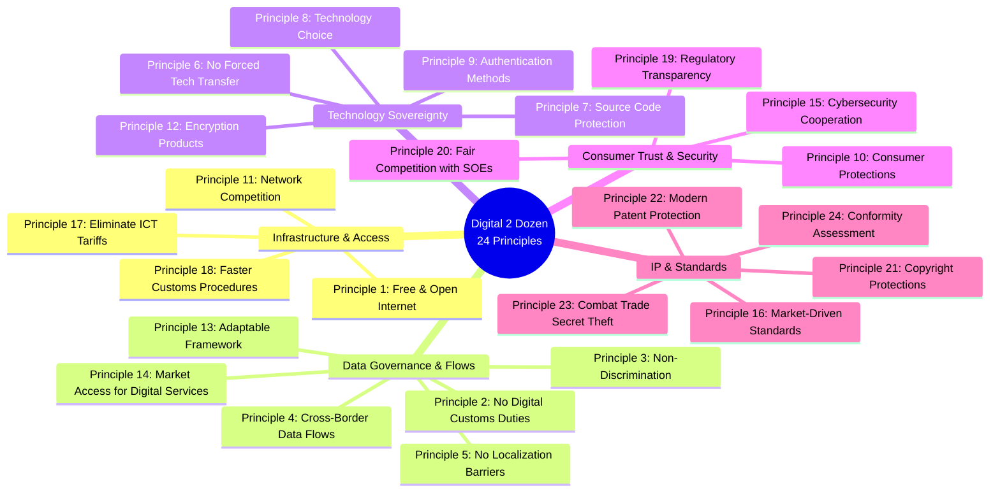
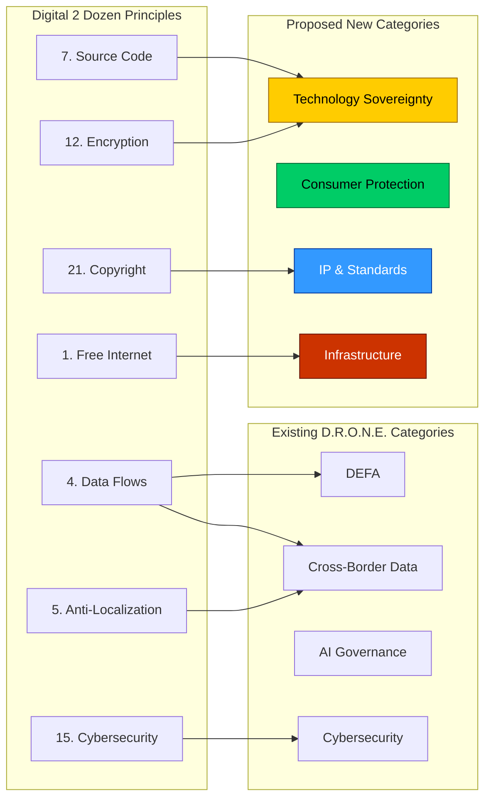
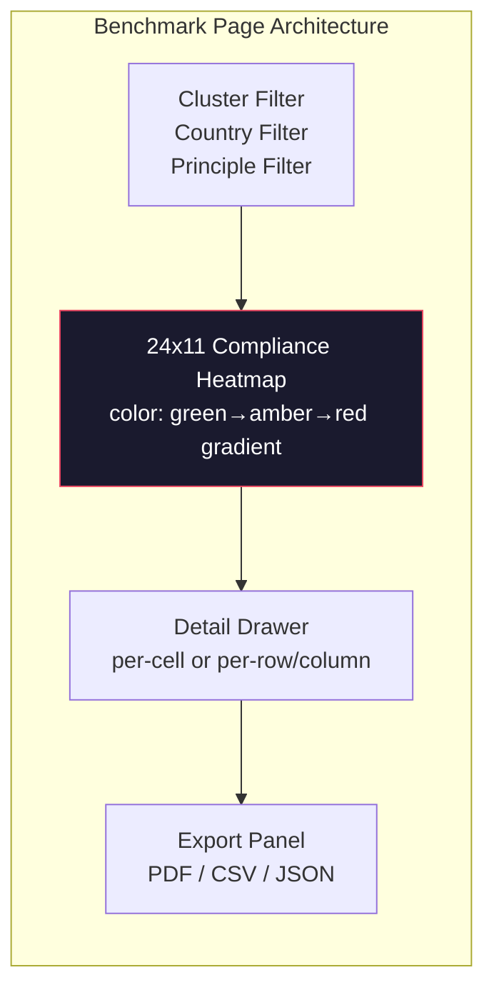
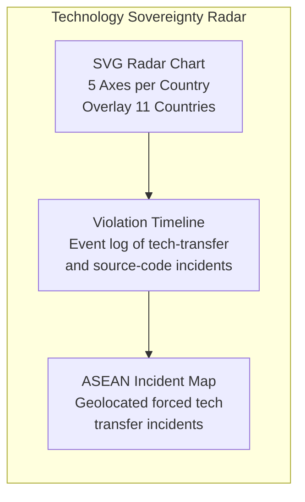
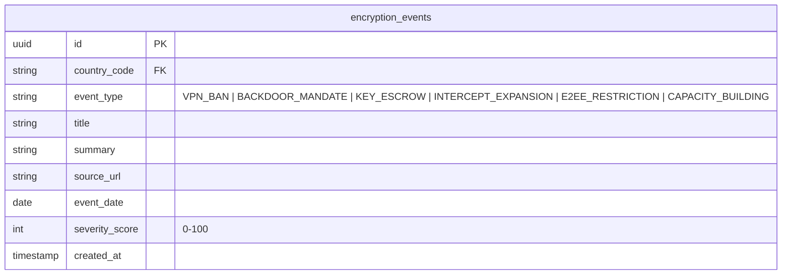
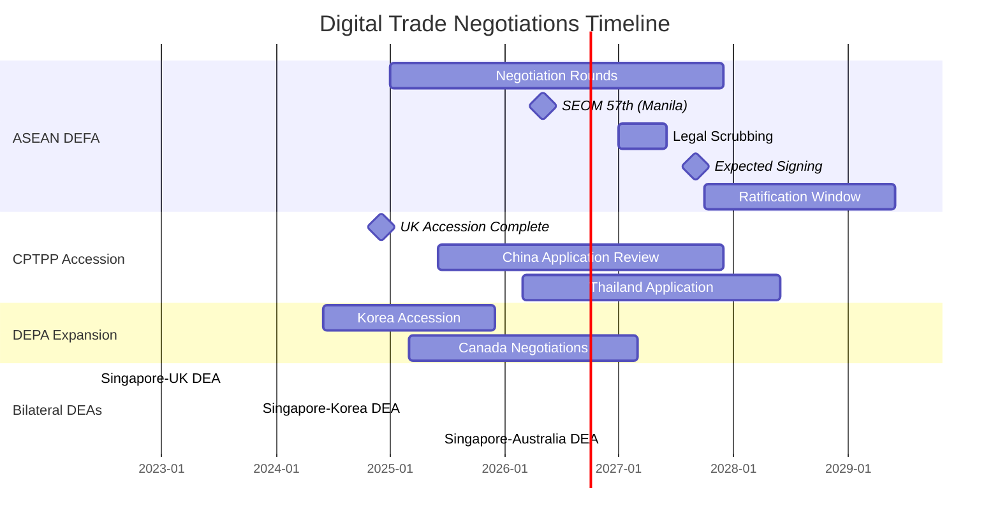
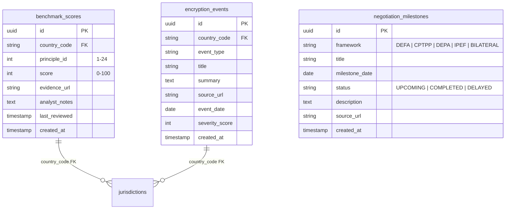

# USTR Digital 2 Dozen — Deep Analysis & D.R.O.N.E. Feature Brainstorm

> Source: [USTR Digital 2 Dozen (PDF)](https://ustr.gov/sites/default/files/Digital-2-Dozen-Final.pdf)
>
> Published: April 2016 | Origin: Trans-Pacific Partnership (TPP) Digital Trade Chapter
>
> Analysis Date: July 29, 2026

---

## 1. Executive Summary

The **Digital 2 Dozen** is the USTR's canonical articulation of 24 digital trade principles distilled from the Trans-Pacific Partnership (TPP) negotiations. Though the US withdrew from the TPP in 2017, these principles have become the *de facto global benchmark* for digital trade agreements — influencing CPTPP, USMCA, DEPA, and critically, the **ASEAN Digital Economy Framework Agreement (DEFA)** currently under negotiation.

For **D.R.O.N.E.** — which already monitors ASEAN DEFA chapters, cross-border data regimes, AI governance, and cybersecurity threats across 11 Southeast Asian member states — the Digital 2 Dozen represents an **externally validated scoring rubric** against which every ASEAN jurisdiction can be benchmarked. It provides 24 independent axes of measurement, all of which map onto the platform's existing data model and surveillance categories.

### Why This Matters for D.R.O.N.E.

| Dimension | Existing D.R.O.N.E. Coverage | Digital 2 Dozen Gap |
|---|---|---|
| Cross-Border Data Flows | ✅ DEFA Chapter 1, Policy Ledger | 4 TPP principles map directly |
| Data Localization Barriers | ✅ Regime classification (Open/Hybrid/Strict) | 2 TPP principles provide granular scoring |
| Source Code & Tech Sovereignty | ❌ Not tracked | 4 TPP principles — entirely new coverage area |
| Encryption & Authentication | ❌ Not tracked | 2 TPP principles — entirely new coverage area |
| Consumer Protections | ⚠️ Marginal (threat matrix) | 2 TPP principles with enforcement dimensions |
| IP & Trade Secrets | ❌ Not tracked | 5 TPP principles — entirely new coverage area |
| Standards & Interoperability | ⚠️ Implicit via DEFA chapters | 3 TPP principles need explicit tracking |
| Customs & Tariffs | ❌ Not tracked | 2 TPP principles with ICT-specific provisions |
| State-Owned Enterprise Fairness | ❌ Not tracked | 1 TPP principle |
| Regulatory Transparency | ⚠️ Marginal | 1 TPP principle |

**Conclusion: 15 of the 24 principles represent entirely new surveillance dimensions for D.R.O.N.E., expanding its scope from 4 categories to a potential 10-category taxonomy.**

---

## 2. The 24 Principles — Thematic Clustering



---

## 3. Deep Principle-by-Principle Analysis

### 3.1 Infrastructure & Access (Principles 1, 11, 17, 18)

| # | Principle | TPP Source | D.R.O.N.E. Relevance |
|---|---|---|---|
| 1 | **Free & Open Internet** — consumers can access content/apps of choice | Ch. 14, Art. 10 | 🔴 High: Myanmar VPN criminalization, Cambodia NIG, Vietnam content blocking |
| 11 | **Network Competition** — suppliers can build networks, land submarine cables | Ch. 13, Arts. 7-15 | 🟡 Medium: Cambodia NIG centralization, Vietnam infrastructure mandates |
| 17 | **Eliminate Tariffs on ICT Products** — zero tariffs on manufactured ICT goods | Ch. 2, Art. 20 | 🟢 Low: Most ASEAN countries already ITA signatories |
| 18 | **Faster Customs Procedures** — paperless e-customs, express shipments | Ch. 5, Arts. 3-11 | 🟡 Medium: DEFA e-commerce pillar covers this; Brunei/Singapore leading |

### 3.2 Data Governance & Flows (Principles 2-5, 13, 14)

| # | Principle | TPP Source | D.R.O.N.E. Relevance |
|---|---|---|---|
| 2 | **No Digital Customs Duties** — prohibition on customs duties for digital products | Ch. 14, Art. 3 | 🟡 Medium: DEFA covers; Indonesia debated digital service taxes |
| 3 | **Non-Discrimination** — digital products cannot face competitive disadvantage | Ch. 14, Art. 4 | 🔴 High: Core to DEFA; Vietnam/Indonesia domestic preference regimes |
| 4 | **Cross-Border Data Flows** — companies/consumers can move data freely | Ch. 11, Annex 11-B / Ch. 14, Art. 11 | 🔴 High: Already tracked via DEFA data_flows pillar |
| 5 | **No Localization Barriers** — no forced local data centers | Ch. 14, Art. 13 | 🔴 High: Already tracked via regime classification |
| 13 | **Adaptable Framework** — protections evolve with technology | Ch. 9, Art. 11 / Ch. 10-11 | 🟡 Medium: DEFA built-in review; worth explicit tracking |
| 14 | **Market Access for Digital Services** — cloud, consulting, advertising | Ch. 9 / Ch. 10 | 🔴 High: Vietnam PSE registration, Indonesia MR5 PSE scope |

### 3.3 Technology Sovereignty (Principles 6, 7, 8, 9, 12)

| # | Principle | TPP Source | D.R.O.N.E. Relevance |
|---|---|---|---|
| 6 | **No Forced Tech Transfer** — market access not contingent on tech transfer | Ch. 9, Art. 9 | 🔴 High: Indonesia local content (TKDN), Vietnam tech transfer demands |
| 7 | **Source Code Protection** — no forced source code/algo disclosure | Ch. 14, Art. 17 | 🔴 High: Vietnam Draft AI Law (algorithm audits), Indonesia MR5 audit requirements |
| 8 | **Technology Choice** — companies choose their own technology standards | Ch. 9, Art. 9 / Ch. 13, Art. 23 | 🟡 Medium: Cambodia NIG mandated routing, Vietnam telecom equipment restrictions |
| 9 | **Authentication Methods** — diverse electronic signatures & authentication | Ch. 14, Art. 6 | 🟢 Low: Mostly established; digital ID emerging across ASEAN |
| 12 | **Encryption Products** — protect innovation in encryption tools | Ch. 8, Annex 8-B | 🔴 High: Myanmar VPN criminalization, Vietnam encryption registration requirements |

### 3.4 Consumer Trust & Security (Principles 10, 15, 19, 20)

| # | Principle | TPP Source | D.R.O.N.E. Relevance |
|---|---|---|---|
| 10 | **Consumer Protections** — enforceable privacy and consumer safeguards | Ch. 14, Arts. 7, 8, 14 | 🔴 High: Directly maps to existing threat matrix |
| 15 | **Cybersecurity Cooperation** — share threat info, build capacity | Ch. 14, Art. 16 | 🔴 High: Already tracked via cybersecurity category |
| 19 | **Regulatory Transparency** — stakeholder participation in regulation development | Ch. 25-26 | 🟡 Medium: D.R.O.N.E. can track consultation windows and civil society input |
| 20 | **Fair Competition with SOEs** — SOEs compete on quality/price, not favoritism | Ch. 17 / Ch. 13, Art. 16 | 🔴 High: Vietnam VNPT/Viettel, Indonesia Telkomsel, Thailand CAT advantages |

### 3.5 IP & Standards (Principles 16, 21, 22, 23, 24)

| # | Principle | TPP Source | D.R.O.N.E. Relevance |
|---|---|---|---|
| 16 | **Market-Driven Standards & Interoperability** — industry-led, global standards | Ch. 8 / Ch. 13, Art. 23 | 🟡 Medium: Vietnam national standards push, Indonesia SNI mandates |
| 21 | **Copyright Protections** — strong & balanced copyright with safe harbors | Ch. 18, Arts. 65-66, 82 | 🟡 Medium: Platform liability laws emerging across ASEAN |
| 22 | **Modern Patent Protection** — transparent, balanced patent systems | Ch. 18, Sec. F | 🟢 Low: Established patent systems; limited digital trade relevance |
| 23 | **Combat Trade Secret Theft** — criminal procedures for cyber trade secret theft | Ch. 18, Art. 78 | 🟡 Medium: Emerging concern with AI model theft; Vietnam Decree 13 |
| 24 | **Conformity Assessment** — mutual recognition of testing/certification | Ch. 8, Art. 6 | 🟢 Low: Already covered by ASEAN MRA frameworks |

---

## 4. Mapping: Digital 2 Dozen → D.R.O.N.E. Data Model



The above reveals that **D.R.O.N.E.'s current 4-category taxonomy (DEFA, Cross-Border Data, AI Governance, Cybersecurity) only captures ~40% of the Digital 2 Dozen surface area.** Four new categories are needed for full benchmarking coverage.

---

## 5. Feature Brainstorm — New Pages & Visualizations

### 5.1 The Digital 2 Dozen Alignment Matrix (Priority: CRITICAL)

**Concept:** A dedicated `/benchmark` page — a single interactive matrix that scores all 11 ASEAN member states against all 24 TPP principles on a 0–100 compliance scale. Think of it as the D.R.O.N.E. equivalent of the Freedom House "Freedom on the Net" report, but scoped to digital trade provisions.

**Key Components:**
- **Heatmap Grid:** 24 rows (principles) × 11 columns (countries), color-coded by compliance score (Deep Green 80-100 → Deep Red 0-20)
- **Cluster Rollup:** Collapsible rows by 5 thematic clusters with aggregate cluster scores
- **Country Detail Panel:** Click a country column → slide-out drawer with per-principle legislative citations, source URLs, and D.R.O.N.E. analyst notes
- **Principle Detail Panel:** Click a principle row → popover with TPP provision text, DEFA negotiation status, known violations across ASEAN
- **Downloadable Report:** One-click PDF export for advocacy use (CSV, JSON also)

**Data Source Strategy:**
- Pre-seed with research team's manual assessments for all 24 × 11 = 264 data points
- Store as new `benchmark_scores` table in Supabase (country_code, principle_id, score 0-100, evidence_url, analyst_notes, last_reviewed)
- Admin interface for research team score updates
- Public API endpoint for CSO partners

**Visualization:**


### 5.2 Technology Sovereignty Radar (Priority: HIGH)

**Concept:** A new data category — "Technology Sovereignty" — with its own radar/spider visualization comparing all 11 countries across the 5 technology sovereignty principles (Principles 6, 7, 8, 9, 12).

**Rationale:** This is D.R.O.N.E.'s largest coverage gap. No existing tool monitors Southeast Asian forced technology transfer regimes, mandatory source code disclosure laws, algorithmic audit requirements, encryption registration mandates, or technology choice restrictions. This is high-impact territory for the D.R.O.N.E. research team.

**Sub-Principles to Track:**

| Sub-Principle | Indicators to Monitor |
|---|---|
| **Algorithmic Audit Mandates** | Does the country require foreign firms to disclose algorithms to regulators? (Vietnam Draft AI Law, Indonesia MR5) |
| **Source Code Escrow** | Are there source code deposit/escrow requirements? |
| **Encryption Registration** | Must encryption products be registered or backdoored? (Myanmar VPN law, Vietnam Decree 53) |
| **TKDN / Local Content** | What percentage of hardware/software must be locally sourced? (Indonesia TKDN 35%+ for 4G/5G) |
| **Technology Transfer Conditions** | Are investment/market-access approvals conditioned on tech transfer to local firms? |

**Visualization:**


### 5.3 Cross-Border Data Flow Compliance Index (Priority: HIGH)

**Concept:** Builds on the existing DEFA `data_flows` chapter tracking but introduces a **quantitative scoring model** for each country's data transfer regime across 8 sub-dimensions drawn directly from Principles 3, 4, 5, and 14:

1. **Transfer Mechanism Availability** — Adequacy decisions, SCCs, BCRs, CBPR certification
2. **Localization Requirements** — Mandatory onshore storage (yes/partial/no) and scope
3. **Government Access Safeguards** — Warrant requirements, judicial oversight, transparency reports
4. **Data Classification Tiers** — Does the regime distinguish personal vs. non-personal data?
5. **Cross-Border Enforcement** — Can foreign data subjects seek remedies?
6. **Interoperability Agreements** — Participation in APEC CBPR, ASEAN MCCs, DEPA
7. **Digital Service Tax Impact** — Does tax policy create de facto data flow barriers?
8. **Emergency Override Provisions** — Are there national security carve-outs, how broad?

**Scorecard Model:**
- Each sub-dimension scored 0–25 → composite 0–200
- Normalized to 0–100 for heatmap compatibility
- Weighted by threat severity (localization requirements weighted higher than tax impact)

### 5.4 Encryption & Digital Security Observatory (Priority: MEDIUM)

**Concept:** A dedicated tracker monitoring encryption regulation changes across ASEAN, mapping to Principles 12, 15, and 1.

**Tracked Events:**
- VPN registration / criminalization laws
- Encryption backdoor mandates
- Mandatory key escrow legislation
- Lawful intercept expansion bills
- End-to-end encryption restrictions
- Cybersecurity capacity-building cooperation agreements

**Data Model — New Table:**



### 5.5 Consumer Protection & Platform Liability Dashboard (Priority: MEDIUM)

**Concept:** Monitoring Principle 10 against real-world platform governance developments across ASEAN.

**Tracked Dimensions:**
- Platform liability for user content (intermediary liability laws)
- Algorithmic transparency reporting requirements (Thailand ETDA audits)
- Data breach notification mandates (covered by most ASEAN PDP laws)
- Unsolicited commercial electronic message (spam) regulations
- Online dispute resolution mechanisms
- Dark pattern / deceptive design restrictions

### 5.6 Digital Trade Negotiations Timeline (Priority: MEDIUM-LOW)

**Concept:** A Gantt-style timeline visualization tracking multilateral digital trade negotiations that incorporate Digital 2 Dozen principles. Covers:
- **ASEAN DEFA** — negotiation rounds, working group meetings, ministerial sign-offs
- **CPTPP** — accession progress for ASEAN CPTPP members (Singapore, Malaysia, Vietnam, Brunei)
- **DEPA** — Digital Economy Partnership Agreement expansion
- **IPEF** — Indo-Pacific Economic Framework digital pillar
- **Bilateral Digital Economy Agreements** — Singapore's DEA network (UK, Korea, Australia, EU)

**Visualization:**


### 5.7 IP & Trade Secret Risk Monitor (Priority: LOWER)

**Concept:** Tracking Principle 23 (trade secret theft) and Principle 21 (copyright safe harbors) — critical for AI model governance. As ASEAN nations deploy AI, the risk of model exfiltration and improper IP seizure rises.

**Tracked Dimensions:**
- Trade secret protection adequacy in criminal codes
- Cyber-enabled trade secret theft prosecution records
- Copyright safe harbor provisions for ISPs/platforms
- AI training data copyright status and exceptions
- Patent disclosure requirements that may force IP leakage

### 5.8 Principle Impact Simulator (Priority: EXPERIMENTAL — FUTURE)

**Concept:** An interactive "what-if" sandbox where users can toggle Digital 2 Dozen principles on/off and visualize the projected economic impact on ASEAN digital trade.

**Data Inputs:**
- OECD Digital Services Trade Restrictiveness Index (DSTRI) baselines
- World Bank digital trade flow data
- ASEAN Secretariat DEFA impact assessments
- D.R.O.N.E.'s own compliance scores as multipliers

**Output:** Projected GDP impact, digital trade volume delta, foreign direct investment sensitivity.

---

## 6. Implementation Roadmap

```mermaid
flowchart TB
    subgraph "Phase 1: Foundation (4-6 weeks)"
        P1A["New categories in constants.ts<br/>TECH_SOVEREIGNTY, CONSUMER_PROT, IP_STANDARDS, INFRASTRUCTURE"]
        P1B["benchmark_scores table in schema.ts<br/>+ Drizzle migration"]
        P1C["/api/benchmark endpoint"]
        P1D["Admin score entry UI"]
    end

    subgraph "Phase 2: Benchmark Page (3-4 weeks)"
        P2A["/benchmark page route"]
        P2B["24x11 Compliance Heatmap component<br/>Recharts or custom SVG"]
        P2C["Country Detail Drawer"]
        P2D["Principle Detail Popover"]
        P2E["PDF/CSV Export"]
    end

    subgraph "Phase 3: Technology Sovereignty (3-4 weeks)"
        P3A["Tech Sovereignty Radar page<br/>SVG radar chart (d3-shape)"]
        P3B["encryption_events table + CRUD"]
        P3C["Violation Timeline component"]
    end

    subgraph "Phase 4: Advanced Visualizations (3-4 weeks)"
        P4A["Negotiations Timeline (Gantt)"]
        P4B["Consumer Protection Dashboard"]
        P4C["Data Flow Compliance Index scorecards"]
    end

    subgraph "Phase 5: Experimental (Future)"
        P5A["Principle Impact Simulator"]
        P5B["IP Trade Secret Monitor"]
    end

    P1A --> P1B
    P1B --> P1C
    P1C --> P1D
    P1D --> P2A
    P2A --> P2B --> P2C --> P2D --> P2E
    P2E --> P3A --> P3B --> P3C
    P3C --> P4A --> P4B --> P4C
    P4C --> P5A --> P5B

    style P1A fill:#003399,stroke:#001a4d,color:#fff
    style P2A fill:#003399,stroke:#001a4d,color:#fff
    style P3A fill:#cc0000,stroke:#660000,color:#fff
    style P4A fill:#cc0000,stroke:#660000,color:#fff
    style P5A fill:#666666,stroke:#333333,color:#fff
```



---

## 7. Expanded Category Taxonomy

Current categories (4):

```
DEFA | Cross-Border Data | AI Governance | Cybersecurity
```

Proposed expansion (10):

| # | Category | Maps to Digital 2 Dozen Principles | Existing D.R.O.N.E. Coverage |
|---|---|---|---|
| 1 | **DEFA** | 2, 3, 13 | ✅ Full |
| 2 | **Cross-Border Data** | 4, 5, 14 | ✅ Full |
| 3 | **AI Governance** | 7 (partial) | ✅ Full |
| 4 | **Cybersecurity** | 1, 15 | ✅ Full |
| 5 | **Technology Sovereignty** | 6, 7, 8, 9, 12 | ❌ New |
| 6 | **Consumer Protection** | 10, 19 | ❌ New |
| 7 | **IP & Standards** | 16, 21, 22, 23, 24 | ❌ New |
| 8 | **Infrastructure & Access** | 1, 11, 17, 18 | ❌ New |
| 9 | **Encryption & Auth** | 9, 12 | ❌ New |
| 10 | **Competition & SOEs** | 20 | ❌ New |

---

## 8. Architecture Considerations

### 8.1 New Database Tables



### 8.2 Visualization Library Strategy

| Visualization | Recommended Library | Rationale |
|---|---|---|
| 24×11 Heatmap | Custom CSS Grid + Tailwind | Simple grid, no library overhead |
| Radar/Spider Chart | **d3-shape** + SVG (already have d3-geo) | Consistent with existing map stack; no new dependency |
| Gantt Timeline | **d3** or custom CSS | Avoid heavy Gantt libs; simple timeline |
| Compliance Scorecards | Custom shadcn/ui Cards | Already in the component library |
| Export PDF | **jsPDF** or **html2canvas** | Lightweight, client-side rendering |

### 8.3 API Architecture

```
GET /api/benchmark?country=VN&cluster=data_governance
  → Returns filtered benchmark scores with evidence URLs

GET /api/benchmark/compare?countries=VN,ID,SG
  → Returns side-by-side comparison data

GET /api/encryption-events?country=VN&event_type=VPN_BAN
  → Returns filtered encryption regulation events

GET /api/negotiations?framework=DEFA
  → Returns negotiation milestones in timeline format

POST /api/revalidate?tag=benchmark
  → ISR revalidation on score updates
```

---

## 9. Competitive Analysis — Why D.R.O.N.E. Should Own This

| Tool / Report | Covers ASEAN? | Covers Digital 2 Dozen? | Public API? | Interactive Viz? |
|---|---|---|---|---|
| **OECD DSTRI** | Partial (5 ASEAN) | Partial (~12 principles) | No | Static PDF |
| **Freedom on the Net** | Partial (6 ASEAN) | Partial (~8 principles) | No | Static tables |
| **ITIF Digital Trade Index** | No | ~18 principles | No | Static report |
| **US Chamber Digital Trade Index** | No | ~15 principles | No | Static report |
| **D.R.O.N.E. (proposed)** | **11/11 ASEAN** ✅ | **24/24 principles** ✅ | **REST API** ✅ | **SVG maps, radar, heatmaps** ✅ |

**D.R.O.N.E. would be the first tool to provide full Digital 2 Dozen compliance benchmarking for all of Southeast Asia with interactive visualization and a public API.**

---

## 10. Key Risks & Mitigations

| Risk | Mitigation |
|---|---|
| **Score subjectivity** — compliance scoring is inherently judgmental | Clear methodology docs; multiple analyst review; public changelog for score revisions |
| **Data freshness** — regulatory landscapes change rapidly | `last_reviewed` timestamp with auto-flagging of scores > 6 months old; admin dashboard alert |
| **Political sensitivity** — some ASEAN governments may push back on low scores | Cite only public legislative sources; avoid editorial language; note D.R.O.N.E.'s research independence |
| **Maintenance burden** — 264 data points is significant | Phase rollout: start with 6 highest-impact principles × all countries; expand iteratively |

---

## 11. Immediate Next Steps

1. **This week:** Add 6 new categories to `constants.ts` and `schema.ts` category enums
2. **Next sprint:** Create `benchmark_scores` table + Drizzle migration + `/api/benchmark` read endpoint
3. **Following sprint:** Build `/benchmark` page with initial 6-principle × 11-country heatmap
4. **Design session:** Prototype Technology Sovereignty Radar using `d3-shape` radar projection
5. **Research:** Begin scoring the first 6 principles (data flows, localization, source code, encryption, consumer protection, cybersecurity) for all 11 countries
