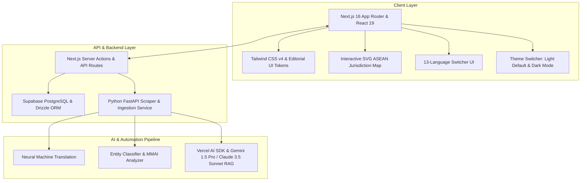
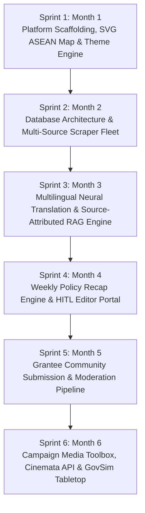
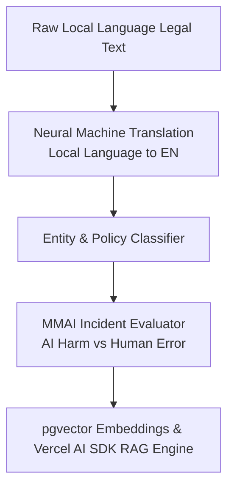

# D.R.O.N.E. ASEAN Policy Hub: Web Application Architecture & 6-Sprint Engineering Roadmap

> **Author**: Okihita  
> **Date**: July 2026  
> **Target Project**: D.R.O.N.E. (Digital Rights Oversight & Network Evaluator)  
> **Client / Organization**: EngageMedia  
> **Scope**: End-to-End Web App Engineering Roadmap (6 Months / 6 Sprints)  
> **Status**: Approved Implementation Architecture  

---

## 1. Executive Architecture & Technology Stack

The **D.R.O.N.E. ASEAN Policy Hub** is an independent, high-performance policy intelligence portal and data observatory. Designed around an authoritative editorial journalism information architecture, the application is built on **Next.js 16** (App Router & Turbopack), **React 19**, **Tailwind CSS v4**, **Supabase** (PostgreSQL with `pgvector`), **Drizzle ORM**, **Vercel AI SDK**, and a Python-driven scraper fleet.

### Core Technology Stack (2026 Standards)
* **Frontend Framework**: Next.js 16 (App Router, Turbopack default bundler, `"use cache"` directive, Partial Prerendering), React 19, TypeScript
* **Styling & Editorial Typography**: Tailwind CSS v4 (Rust-based engine, `@theme` configuration, `@variant dark`), Google Fonts (`Newsreader` editorial serif, `Inter` sans, `JetBrains Mono` data font), Lucide React icons
* **Database & ORM**: Supabase (Managed PostgreSQL with `pgvector`), Drizzle ORM (type-safe, thin SQL abstraction, 12KB gzipped, zero cold starts)
* **Authentication**: Supabase Auth / Better Auth (multi-tenancy & role-based access control)
* **Scraper & Ingestion Fleet**: Python (Scrapy, Playwright), Celery worker fleet, Redis task queue
* **AI & RAG Engine**: Vercel AI SDK (agentic primitives, `streamText`, multi-step tool calls), Neural Machine Translation API, Gemini 1.5 Pro / Claude 3.5 Sonnet RAG pipeline
* **Exporters & Rendering**: `@react-pdf/renderer` (server-side PDF dossier generation), Resend API (HTML email newsletters), Shiki (code syntax highlighting)
* **Hosting & Infrastructure**: Vercel (Edge functions & Serverless frontend), Supabase (Managed DB & Vector Store), Railway/Docker (Python Scrapers)

---

## 2. 6-Sprint Incremental Engineering Roadmap

Each sprint represents roughly **one month of dedicated development**. Every sprint builds directly upon the validated foundation of the previous sprint.

---

### Sprint 1 (Month 1): Core Platform Scaffolding, Editorial Design System, SVG Map & Theme Engine

**Objective**: Establish the web application codebase, editorial typography design system, interactive vector SVG map of Southeast Asia, 13-language switcher, and light mode default with dark mode toggle.

* **Repository & Tech Stack Initialization**:
  * Next.js 16 App Router with TypeScript, Tailwind CSS v4, Turbopack, and ESLint/Prettier.
  * Configure Vercel deployment pipeline with staging and production environments.
* **Editorial Design System & Typography Layout**:
  * Implement Google Fonts (`Newsreader` serif, `Inter` sans, `JetBrains Mono` data font).
  * Build Light Mode default theme with system preference detection (`prefers-color-scheme`) and interactive `ThemeToggle` component (Light / Dark / System).
  * Create newspaper/think-tank masthead header, 13-language dropdown UI, search bar, and SEO meta tags.
* **Interactive Vector SVG ASEAN Map Component (`AseanMap.tsx`)**:
  * Build vector SVG map covering 11 Southeast Asian nations (ID, MY, SG, PH, TH, VN, KH, LA, MM, BN, TL).
  * Implement hover tooltips, click handlers, map regime filters (*Open Transfer*, *Hybrid*, *Strict Localization*), and Country Dossier Inspection Modal.
* **Verified Policy Ledger & Data Table (`PolicyLedgerTable.tsx`)**:
  * Build searchable data table with category filters (*DEFA*, *Cross-Border Data*, *AI Governance*, *Cybersecurity*), threat badges, and primary text links.

---

### Sprint 2 (Month 2): Database Architecture, Multi-Source Aggregator & Automated Scraping Fleet

**Objective**: Build the PostgreSQL database schema, Drizzle ORM models, and Python-based automated web scraping engine to ingest policy documents across ASEAN.

* **Database Schema & Drizzle ORM Setup**:
  * Design schema for `Jurisdictions`, `Policies`, `NewsItems`, `Categories`, `Sources`, and `Users`.
  * Enable `pgvector` extension in Supabase PostgreSQL for vector embeddings.
* **Python Automated Scraping Engine**:
  * Build Scrapy/Playwright crawlers for official ASEAN Secretariat portals, national parliamentary gazettes (e.g., Kominfo ID, IMDA SG, ETDA TH, DICT PH), and regional investigative news APIs.
  * Configure Redis + Celery task queue for automated daily ingestion cron jobs.
* **Document Ingestion & Sanitization Pipeline**:
  * Extract raw HTML/PDF legal texts, strip noise, sanitize encodings, and apply SHA-256 deduplication.
* **Repository API Routes & Document Explorer UI**:
  * Build server actions and API routes (`/api/policies`, `/api/jurisdictions/[code]`).
  * Build frontend search and filter components by country, policy maturity, and topic.

---

### Sprint 3 (Month 3): Multilingual Neural Translation, Entity Classifier & RAG Engine

**Objective**: Integrate AI capabilities to automatically translate regional policy texts, classify policy categories, and power a source-verified RAG (Retrieval-Augmented Generation) query system.

* **Multilingual Translation Service**:
  * Neural translation API pipeline converting Thai, Vietnamese, Bahasa Indonesia, Khmer, Lao, and Burmese policy updates into English.
* **Entity Classifier & Policy Tagging**:
  * Automated tagging: `[DEFA]`, `[Cross-Border Data]`, `[AI Ethics]`, `[Cybersecurity]`, `[Tariffs]`.
* **MMAI Incident Analysis Engine**:
  * Automated decision-tree evaluator to score reported automated harm incidents (distinguishing algorithmic decisions from human error).
* **Source-Attributed RAG Engine**:
  * Generate vector embeddings via `pgvector` and query via Vercel AI SDK v4.
  * Ensure every generated digest includes direct hyperlinked quotes to primary legal text.

---

### Sprint 4 (Month 4): "Pulse of ASEAN" Weekly Recap Engine & HITL Editor Portal

**Objective**: Automate the generation of weekly policy recaps while providing a dedicated Human-in-the-Loop (HITL) editor dashboard for EngageMedia staff.

* **Automated Weekly Recap Synthesis Engine**:
  * Scheduled Thursday night cron job analyzing the week's ingested policies and drafting a structured 3-minute executive summary.
* **HITL Editor Portal (`/admin/recap-editor`)**:
  * Secure admin dashboard for EngageMedia editors to review, edit, approve, or reject draft recaps.
  * Add manual threat badges (`[High Alert]`, `[Medium Risk]`, `[Rights Verified]`) and political context notes.
* **Multi-Format Export & Publishing Engine**:
  * **Web Portal**: Publish directly to `/weekly-recaps/[slug]`.
  * **PDF Exporter**: Server-side PDF export utilizing `@react-pdf/renderer`.
  * **Newsletter Service**: Automated HTML email generation via Resend API.
  * **RSS/Atom Feed**: Dynamic XML feed for syndication.

---

### Sprint 5 (Month 5): Community Submission & Open Publishing Pipeline

**Objective**: Enable regional grantees, human rights defenders, and independent researchers to submit policy alerts, leaked draft texts, and local analyses securely.

* **Secure Community Submission Form (`/submit-dossier`)**:
  * Build encrypted submission form allowing file uploads (PDF, DOCX, images).
  * Flexible attribution controls: Public Credit, Co-Branded Partner, or Anonymous Defender Protection.
* **Editorial Moderation Queue (`/admin/community-submissions`)**:
  * Internal workflow dashboard for EngageMedia editors to review user submissions, sanitize metadata, and approve publication.
* **Regional Partner Directory & Co-Branding**:
  * Partner profile pages displaying grantee contributions and local policy insights.

---

### Sprint 6 (Month 6): Campaign Toolbox, Cinemata Integration & GovSim Stress-Testing Module

**Objective**: Complete the platform by integrating campaign media generators, Cinemata video embeds, and the interactive GovSim tabletop simulation module.

* **Campaign & Media Kit Generator**:
  * Automated canvas generation for downloadable social media graphic cards, press release templates, and visual infographics.
* **Cinemata Video Platform API Integration**:
  * Connect EngageMedia's *Cinemata* documentary video API to automatically embed relevant human rights and environmental documentaries alongside policy topics.
* **GovSim (Decision Rehearsal & Scenario Stress-Testing Module)**:
  * Build interactive tabletop scenario module (`/govsim`) allowing policy teams to model "what-if" governance scenarios against existing ASEAN laws.
* **Security Audit, Performance Optimization & Final Launch**:
  * Penetration testing, accessibility compliance (WCAG 2.1 AA), lighthouse performance optimization (>95 score), and official public release.

---

## 3. Summary of Deliverables Matrix

| Sprint | Timeline | Core Focus | Technical Output (2026 Tech Stack) |
| :--- | :--- | :--- | :--- |
| **Sprint 1** | Month 1 | Scaffolding, SVG Map & Themes | Next.js 16 + React 19 + Tailwind v4, Newsreader/Inter fonts, SVG ASEAN map, 13-language UI, ThemeToggle |
| **Sprint 2** | Month 2 | Database & Scraping Fleet | Supabase PostgreSQL + Drizzle ORM (`pgvector`), Python Scrapy/Playwright crawler fleet |
| **Sprint 3** | Month 3 | Translation & RAG Engine | Neural Translation API, Policy Classifier, Vercel AI SDK Vector RAG API |
| **Sprint 4** | Month 4 | Weekly Recap & HITL Portal | Auto-recap generator, `/admin` editor dashboard, `@react-pdf/renderer` & Resend |
| **Sprint 5** | Month 5 | Community Submission | Secure `/submit-dossier` form, grantee moderation queue, partner profiles |
| **Sprint 6** | Month 6 | Campaign & GovSim Engine | Graphic generator, Cinemata video embeds, `/govsim` tabletop module |

---

### Related Implementation Files
* [02_Content_Branding_and_Socials_Strategy.md](file:///Users/okihita/Documents/Grimoire/Projects/EngageMedia/ASEAN%20Policy%20Hub/Implementation/02_Content_Branding_and_Socials_Strategy.md)
* [03_Project_Branding_Plan.md](file:///Users/okihita/Documents/Grimoire/Projects/EngageMedia/ASEAN%20Policy%20Hub/Implementation/03_Project_Branding_Plan.md)
