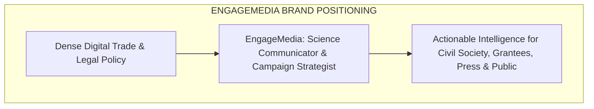
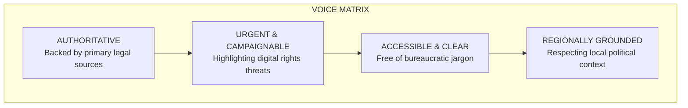
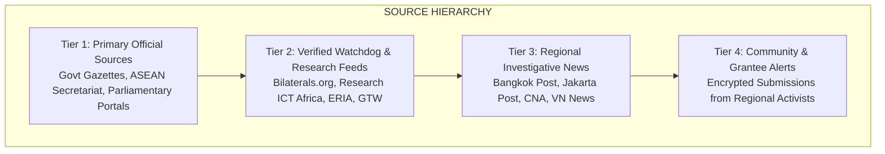
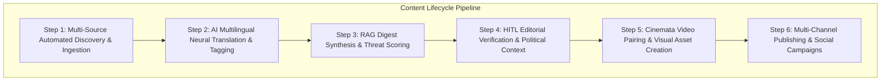
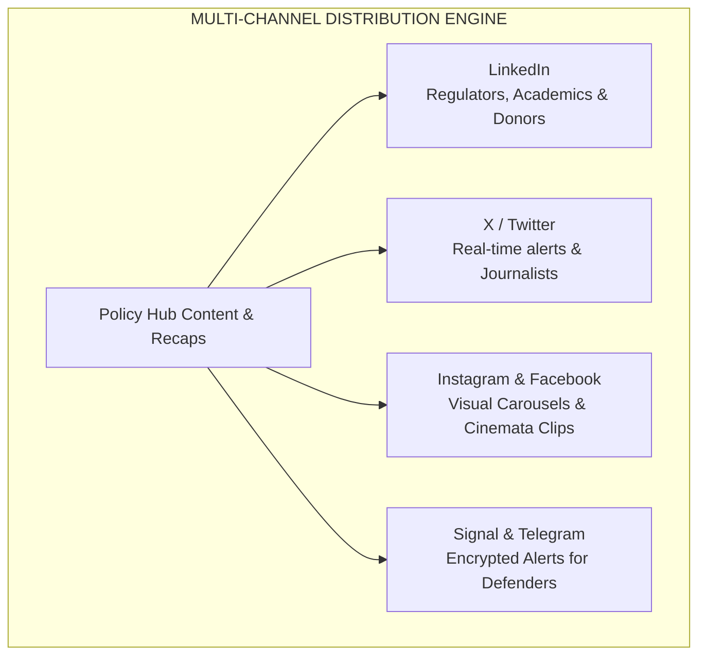

# ASEAN Policy Hub: Content, Branding, Tone & Social Media Strategy

> **Author**: Okihita  
> **Date**: July 2026  
> **Target Project**: EngageMedia ASEAN Policy Hub Portal  
> **Scope**: Comprehensive Brand Identity, Editorial Tone, Source Taxonomy & Social Media Campaign Strategy  
> **Status**: Approved Operational Blueprint  

---

## 1. Strategic Brand Positioning

### 1.1 Core Mission
The **EngageMedia ASEAN Policy Hub** bridges the gap between high-level, complex digital policy legalism (such as the ASEAN DEFA, cross-border data frameworks, and AI governance) and grassroots civil society action across Southeast Asia.

### 1.2 EngageMedia’s Dual Identity
* **As a Science Communicator**: Translates obscure regulatory language, technical trade jargon, and algorithmic policies into visually engaging, accessible, and human-centered stories.
* **As a Campaign Strategist**: Equips regional activists, human rights defenders, independent journalists, and grantees with actionable threat matrices, media kits, and campaign toolboxes to defend digital rights before bills become law.

### 1.3 Core Brand Pillars & Values
1. **Rights-Centered**: Every policy analysis evaluates the impact on human rights, digital expression, privacy, and online civic space.
2. **Evidence-Based & Source-Verified**: Zero speculation. Every claim is linked directly to primary legal texts or verified documentation.
3. **Regionally Grounded**: Prioritizes Global South and Southeast Asian perspectives, rejecting one-size-fits-all Western regulatory paradigms.
4. **Accessible & Anti-Jargon**: Explains complex policy shifts in clear, scannable language tailored for diverse regional audiences.

---

## 2. Voice & Tone Guidelines

The voice of the ASEAN Policy Hub is **authoritative yet urgent, analytical yet accessible**.

### 2.1 Tone Breakdown by Target Persona

| Target Audience | Desired Tone | Operational Style | Key Messaging Angle |
| :--- | :--- | :--- | :--- |
| **Civil Society & Grantees** | Empowering, urgent, actionable | Highlighting policy threats, campaign action points, local impacts | *"Here is how this pending bill impacts your digital rights and campaign work."* |
| **Journalists & Media** | Precise, fast, source-linked | Providing 3-minute executive digests, direct legal quotes, press kits | *"Here is the verified data and primary text link for your story."* |
| **Policy Experts & Regulators** | Rigorous, evidence-based, objective | Comparative legal matrices, DFFT analysis, regulatory benchmarking | *"Here is how ASEAN member states compare on cross-border data rules."* |
| **General Public** | Accessible, visual, human-centered | Visual infographics, *Cinemata* documentary pairings, clear summaries | *"What the ASEAN DEFA means for your online privacy and everyday digital life."* |

### 2.2 Multilingual Voice Adaptation
* **English**: Primary working language for regional comparative policy; uses clear, concise international policy terms.
* **Bahasa Indonesia / Tagalog / Thai / Vietnamese**: Localized summaries maintain cultural and political sensitivity, adapting technical jargon into natural local terminology while upholding strict rights-focused principles.

---

## 3. Authoritative Source Taxonomy & Ingestion Rules

To ensure 100% credibility, the ASEAN Policy Hub operates under a strict source hierarchy:

### 3.1 Primary Government & Regulatory Sources (Tier 1)
* **ASEAN Level**: ASEAN Secretariat Official Portal, SEOM Press Releases, ASEAN Digital Ministers Meeting (ADGMIN) statements.
* **Indonesia**: Ministry of Communication and Informatics (Kominfo), DPR RI Parliamentary Portal, BSSN.
* **Singapore**: Infocomm Media Development Authority (IMDA), Smart Nation Group, Personal Data Protection Commission (PDPC).
* **Thailand**: Electronic Transactions Development Agency (ETDA), Ministry of Digital Economy and Society (MDES).
* **Philippines**: Department of Information and Communications Technology (DICT), National Privacy Commission (NPC).
* **Vietnam**: Ministry of Information and Communications (MIC), National Assembly Portal.
* **Malaysia, Cambodia, Laos, Myanmar, Brunei, Timor-Leste**: Official gazettes and national regulatory portals.

### 3.2 Verification & Attribution Rules
1. **Primary Source Mandate**: Every weekly recap item must cite at least one Tier 1 or verified Tier 2 source.
2. **Zero Hallucination Attribution**: All AI-generated summaries must embed direct hyperlink citations to raw source texts.
3. **Leaked/Draft Text Verification**: Unofficial draft texts (e.g., e-commerce negotiations) must be cross-verified by at least two independent regional experts before public publication.

---

## 4. End-to-End Content Lifecycle Pipeline

### Step Breakdown

#### Step 1: Automated Discovery & Ingestion
* Python crawlers and RSS aggregators continuously monitor Tier 1 & Tier 2 feeds across 11 jurisdictions.

#### Step 2: AI Neural Translation & Tagging
* Incoming local-language texts are translated into English and automatically tagged: `[DEFA]`, `[Cross-Border Data]`, `[AI Ethics]`, `[Surveillance]`.

#### Step 3: RAG Digest Synthesis & Threat Scoring
* The AI engine generates a 3-bullet executive digest and assigns an initial threat level (1 to 5) for civil society impact.

#### Step 4: Human-in-the-Loop (HITL) Editorial Verification
* On Friday morning, an EngageMedia editor reviews the AI draft, verifies source links, adds regional political nuances, and approves publication.

#### Step 5: Cinemata Video Pairing & Asset Creation
* Editors pair policy stories with relevant human rights/environmental documentaries hosted on *Cinemata*, while the engine auto-generates visual graphic cards.

#### Step 6: Multi-Channel Distribution
* Content is published simultaneously to the Web Hub, Email Newsletter, PDF Briefings, and Social Media channels.

---

## 5. Multi-Channel Social Media & Campaign Strategy

To maximize regional impact, content is tailored across distinct publishing channels:

### 5.1 Platform-Specific Campaign Execution

#### 1. LinkedIn (Target: Regulators, International NGOs, Donors & Academics)
* **Format**: Deep-dive articles, infographic carousels, regional policy matrix comparisons.
* **Cadence**: 2-3 posts per week.
* **Content Focus**: High-level ASEAN DEFA developments, cross-border data transfer comparisons, rights-centered AI governance models.

#### 2. X / Twitter (Target: Journalists, Campaigners, Rights Defenders & Tech Policy Lead)
* **Format**: Real-time policy alerts, multi-tweet thread breakdowns, tagging regional journalists and watchdogs.
* **Cadence**: Daily updates + Friday Weekly Recap Thread.
* **Content Focus**: Urgent policy shifts, breaking legislative news, Big Tech deregulatory counter-matrix.

#### 3. Instagram & Facebook (Target: General Public, Youth Activists & Regional Citizens)
* **Format**: High-impact visual quote cards, explainer carousels, short documentary clips from *Cinemata*.
* **Cadence**: 3-4 visual posts per week.
* **Content Focus**: "What DEFA means for your online privacy", gig-economy worker rights, visual policy explainers.

#### 4. Encrypted Channels: Signal & Telegram (Target: Frontline Human Rights Defenders & Grantees)
* **Format**: Secure, plain-text policy alerts, threat warnings, encrypted PDF briefing links.
* **Cadence**: As needed for urgent policy alerts + Friday weekly summary.
* **Content Focus**: Privacy threats, cybersecurity law updates, surveillance alerts in sensitive political environments.

---

## 6. Campaign & Media Kit Toolbox

To empower partner civil society groups to lead their own local campaigns, every major policy recap includes a downloadable **Campaign & Media Kit**:

* **Key Campaign Messaging & Talking Points**: Scannable bullet points for public advocates.
* **Social Media Graphic Cards**: Pre-formatted 1:1 and 16:9 images for Instagram, X, and Facebook.
* **Sample Press Release**: Customizable press release templates for local civil society organizations.
* **Cinemata Video Screening Guide**: Instructions for pairing documentary screenings with policy advocacy events.

---

### Related Implementation Files
* [01_Web_App_Sprint_Roadmap.md](file:///Users/okihita/Documents/Grimoire/Projects/EngageMedia/ASEAN%20Policy%20Hub/Implementation/01_Web_App_Sprint_Roadmap.md)
