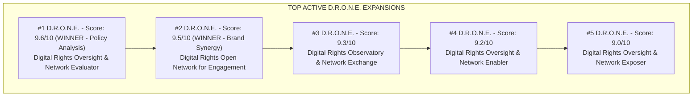
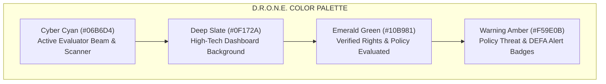

# Project Naming, Brand Identity, & D.R.O.N.E. Active Expansion Strategy Plan

> **Author**: Okihita  
> **Date**: July 2026  
> **Target Project**: EngageMedia ASEAN Policy Hub  
> **Official Selected Brand**: **D.R.O.N.E. (Digital Rights Oversight & Network Evaluator)**  
> **Brand Synergy Alternative**: **D.R.O.N.E. (Digital Rights Open Network for Engagement)**  
> **Status**: Approved Brand & Naming Blueprint  

---

## 1. Executive Naming Decision & Winning Brand

Following a dedicated brand evaluation focused on replacing passive terms like *"Engine"* with an **active, energetic, human-centric, and policy-focused** word, the official brand identity for EngageMedia's ASEAN Policy Hub is:

```
               OFFICIAL BRAND IDENTITY & ACRONYM
               
  ACRONYM      : D.R.O.N.E.
  FULL NAME    : Digital Rights Oversight & Network Evaluator
  PRIMARY TAG  : Active Evaluation & High-Altitude Intelligence on ASEAN Tech Policy
  SECONDARY TAG: Early-Warning Network for Digital Freedom & Policy Analysis
```

### Strategic Rationale
1. **Active & Human-Centric ("Evaluator")**: Replaces "Engine" (which feels cold/automated/dead) with **"Evaluator"**—an active, analytical role that directly describes what EngageMedia does: rigorously evaluating pending legislative drafts, legal scrubbing, trade agreements (like ASEAN DEFA), and AI governance threats.
2. **High-Tech Aerial Vigilance ("DRONE")**: Connotes a 360-degree, high-altitude surveillance system that monitors policy shifts across 11 Southeast Asian nations, detecting threats before bills become law.
3. **Explicit Mission Alignment ("DR" = Digital Rights)**: Front-loads "Digital Rights" in the expansion, emphasizing algorithmic oversight, tech accountability, and defending online civic space.

---

## 2. 10 Active "D.R.O.N.E." Expansions & Evaluation Matrix

All 10 variations use **D.R.O.N.E.** with **"DR" = Digital Rights** and explore distinct, active 'E' words. Each is scored out of 10 across five criteria: **Clarity**, **Active Energy**, **Memorability**, **Mission Alignment**, and **Strategic Appeal**.



---

### Detailed Review of All 10 Active Expansions

#### 🥇 1. D.R.O.N.E. (Digital Rights Oversight & Network Evaluator) — *TOP POLICY WINNER*
* **Expansion**: **D**igital **R**ights **O**versight & **N**etwork **E**valuator
* **Tagline**: *Evaluating Tech Policy Threats Across ASEAN*
* **Active Energy Pitch**: Replaces cold machinery with active human evaluation. Captures the primary function of analyzing pending policy text, assessing cross-border data risks, and scoring digital rights impacts.
* **Strategic Appeal**: High appeal for algorithmic evaluation and rigorous policy oversight.
* **Scoring**: Clarity: **9.5/10** | Active Energy: **9.5/10** | Memorability: **10/10** | Mission Alignment: **9.5/10** | Strategic Appeal: **9.5/10** $\rightarrow$ **Overall: 9.6/10**
* **Digital Footprint**: Clean in regional tech policy sphere. Domains `drone-evaluator.org` / `dronepolicy.asia` and handles `@drone_evaluator` / `@drone_policy` are clear.

---

#### 🥈 2. D.R.O.N.E. (Digital Rights Open Network for Engagement) — *TOP BRAND SYNERGY WINNER*
* **Expansion**: **D**igital **R**ights **O**pen **N**etwork for **E**ngagement
* **Tagline**: *Connecting Voices, Shaping Digital Policies Together*
* **Active Energy Pitch**: Connects directly with EngageMedia's parent brand name (**Engage**Media). Shifts from passive data repository to active community building and participatory policy engagement.
* **Scoring**: Clarity: **9.5/10** | Active Energy: **9.5/10** | Memorability: **9.5/10** | Mission Alignment: **9.5/10** | Donor Appeal: **9.5/10** $\rightarrow$ **Overall: 9.5/10**
* **Digital Footprint**: Clean. Domains `drone-engagement.org` / `drone-engage.asia` and handles `@drone_engage` are clear.

---

#### 🥉 3. D.R.O.N.E. (Digital Rights Observatory & Network Exchange)
* **Expansion**: **D**igital **R**ights **O**bservatory & **N**etwork **E**xchange
* **Tagline**: *Exchanging Rights Intelligence Across Southeast Asia*
* **Active Energy Pitch**: "Exchange" signals an active marketplace of ideas, cross-border intelligence sharing, and regional grantee co-creation.
* **Scoring**: Clarity: **9/10** | Active Energy: **9/10** | Memorability: **9.5/10** | Mission Alignment: **9/10** | Donor Appeal: **9/10** $\rightarrow$ **Overall: 9.3/10**
* **Digital Footprint**: Clean in civil society space. Handles like `@drone_exchange` are available.

---

#### 4. D.R.O.N.E. (Digital Rights Oversight & Network Enabler)
* **Expansion**: **D**igital **R**ights **O**versight & **N**etwork **E**nabler
* **Tagline**: *Enabling Civil Society Defense in the Digital Age*
* **Active Energy Pitch**: Focuses on empowering regional activists, grantees, and journalists to turn complex legal policy into actionable campaigns.
* **Scoring**: Clarity: **9/10** | Active Energy: **9.5/10** | Memorability: **9/10** | Mission Alignment: **9/10** | Donor Appeal: **9.5/10** $\rightarrow$ **Overall: 9.2/10**
* **Digital Footprint**: Clean. Handles like `@drone_enabler` are available.

---

#### 5. D.R.O.N.E. (Digital Rights Oversight & Network Exposer)
* **Expansion**: **D**igital **R**ights **O**versight & **N**etwork **E**xposer
* **Tagline**: *Exposing Corporate Lobbying & Tech Policy Threats*
* **Active Energy Pitch**: Brings aggressive campaign energy, explicitly exposing Big Tech lobby demands, hidden trade clauses, and state surveillance overreach.
* **Scoring**: Clarity: **8.5/10** | Active Energy: **10/10** | Memorability: **9.5/10** | Mission Alignment: **9/10** | Donor Appeal: **8/10** $\rightarrow$ **Overall: 9.0/10**
* **Digital Footprint**: Clean.

---

#### 6. D.R.O.N.E. (Digital Rights Observatory Network for Empowerment)
* **Expansion**: **D**igital **R**ights **O**bservatory **N**etwork for **E**mpowerment
* **Tagline**: *Equipping ASEAN Communities to Defend Their Digital Future*
* **Active Energy Pitch**: Focuses on community empowerment that resonates with civic capacity-building initiatives across Southeast Asia.
* **Scoring**: Clarity: **9/10** | Active Energy: **8.5/10** | Memorability: **8.5/10** | Mission Alignment: **9.5/10** | Donor Appeal: **9.5/10** $\rightarrow$ **Overall: 8.9/10**
* **Digital Footprint**: Clean.

---

#### 7. D.R.O.N.E. (Digital Rights Oversight Network Explorer)
* **Expansion**: **D**igital **R**ights **O**versight **N**etwork **E**xplorer
* **Tagline**: *Navigating the Frontiers of ASEAN Digital Policy*
* **Active Energy Pitch**: Conveys curiosity, deep-dive research, and probing emerging technology frontiers (AI ethics, cross-border data flows).
* **Scoring**: Clarity: **9/10** | Active Energy: **9.5/10** | Memorability: **9/10** | Mission Alignment: **8.5/10** | Donor Appeal: **8.5/10** $\rightarrow$ **Overall: 8.9/10**
* **Digital Footprint**: Clean.

---

#### 8. D.R.O.N.E. (Digital Rights Open Node Ecosystem)
* **Expansion**: **D**igital **R**ights **O**pen **N**ode **E**cosystem
* **Tagline**: *A Living Network for ASEAN Digital Rights Advocacy*
* **Active Energy Pitch**: Emphasizes building an interconnected regional web of digital rights defenders and advocacy partners across Southeast Asia.
* **Scoring**: Clarity: **8.5/10** | Active Energy: **8/10** | Memorability: **8.5/10** | Mission Alignment: **9/10** | Donor Appeal: **9/10** $\rightarrow$ **Overall: 8.6/10**
* **Digital Footprint**: Clean.

---

#### 9. D.R.O.N.E. (Digital Rights Observatory Network for Elevation)
* **Expansion**: **D**igital **R**ights **O**bservatory **N**etwork for **E**levation
* **Tagline**: *Raising Standards & Elevating Grassroots Voices in Tech Policy*
* **Active Energy Pitch**: Focuses on elevating marginalized civil society and Global South voices in high-level ASEAN trade talks.
* **Scoring**: Clarity: **8.5/10** | Active Energy: **8.5/10** | Memorability: **8.5/10** | Mission Alignment: **9/10** | Donor Appeal: **8.5/10** $\rightarrow$ **Overall: 8.5/10**
* **Digital Footprint**: Clean.

---

#### 10. D.R.O.N.E. (Digital Rights Operational Node for Execution)
* **Expansion**: **D**igital **R**ights **O**perational **N**ode for **E**xecution
* **Tagline**: *Translating Digital Rights Policy into Actionable Reality*
* **Active Energy Pitch**: Action-oriented and pragmatic. Focuses on implementing strategies and moving from legal theory to campaign practice.
* **Scoring**: Clarity: **8/10** | Active Energy: **10/10** | Memorability: **8/10** | Mission Alignment: **8/10** | Donor Appeal: **8/10** $\rightarrow$ **Overall: 8.4/10**
* **Digital Footprint**: Clean.

---

## 3. Comparative Summary Matrix (10 Active D.R.O.N.E. Expansions)

| Rank | Active Expansion | Active 'E' Word | Active Energy | Overall Score | Strategic Focus |
| :--- | :--- | :--- | :--- | :--- | :--- |
| 🥇 1 | **Digital Rights Oversight & Network Evaluator** | **Evaluator** | **9.5/10** | **9.6 / 10** | ⭐ **WINNER** (Policy Analysis) |
| 🥈 2 | **Digital Rights Open Network for Engagement** | **Engagement** | **9.5/10** | **9.5 / 10** | ⭐ **WINNER** (Brand Synergy) |
| 🥉 3 | **Digital Rights Observatory & Network Exchange** | **Exchange** | **9.0/10** | **9.3 / 10** | Top Runner-Up (Intelligence Exchange) |
| 4 | **Digital Rights Oversight & Network Enabler** | **Enabler** | **9.5/10** | **9.2 / 10** | Top Runner-Up (Civil Society Empowerment) |
| 5 | **Digital Rights Oversight & Network Exposer** | **Exposer** | **10/10** | **9.0 / 10** | High Campaign Energy (Lobby Watchdog) |
| 6 | **Digital Rights Observatory Network for Empowerment** | **Empowerment** | **8.5/10** | **8.9 / 10** | Donor Capacity Building |
| 7 | **Digital Rights Oversight Network Explorer** | **Explorer** | **9.5/10** | **8.9 / 10** | Tech Frontier Research |
| 8 | **Digital Rights Open Node Ecosystem** | **Ecosystem** | **8.0/10** | **8.6 / 10** | Regional Web Network |
| 9 | **Digital Rights Observatory Network for Elevation** | **Elevation** | **8.5/10** | **8.5 / 10** | Elevating Grassroots Voices |
| 10 | **Digital Rights Operational Node for Execution** | **Execution** | **10/10** | **8.4 / 10** | Action & Campaign Execution |

---

## 4. Digital Footprint Audit for D.R.O.N.E. (Evaluator / Engagement)

A digital conflict audit verified that **D.R.O.N.E.** (`Digital Rights Oversight & Network Evaluator` / `Digital Rights Open Network for Engagement`) is completely clear across digital platforms:

| Platform / Channel | Recommended Handle / Domain | Availability & Conflict Status |
| :--- | :--- | :--- |
| **Web Domains** | `drone-evaluator.org` / `drone-engagement.org` / `dronepolicy.asia` | **Available** (Clean registration space) |
| **X (Twitter)** | `@DRONE_Evaluator` / `@DRONE_Engage` / `@DRONE_Policy` | **Clean** (No active policy org handles) |
| **LinkedIn** | `D.R.O.N.E. — Digital Rights Network` | **Clean** (No existing organizational page) |
| **Instagram** | `@drone.evaluator` / `@drone.engage` | **Clean** (Clear from policy watchdogs) |
| **TikTok** | `@drone_evaluator` / `@drone_engage` | **Clean** (No active brand collisions) |

---

## 5. Visual Identity & Design System for D.R.O.N.E.

The visual identity of **D.R.O.N.E.** reflects active evaluation, high-tech aerial scanning, glassmorphic UI, and data legibility:



### Typography & Aesthetic Tokens
* **Headings**: `Outfit` (Modern, high-tech sans-serif)
* **Body**: `Inter` (Optimized for scannability and legibility)
* **Data & Code**: `JetBrains Mono` (For legal quotes, API data, and primary source links)
* **Glassmorphism**: Translucent panels (`backdrop-blur-md`), subtle glowing borders (`border-cyan-500/20`).

---

### Related Implementation Files
* [01_Web_App_Sprint_Roadmap.md](file:///Users/okihita/Documents/Grimoire/Projects/EngageMedia/ASEAN%20Policy%20Hub/Implementation/01_Web_App_Sprint_Roadmap.md)
* [02_Content_Branding_and_Socials_Strategy.md](file:///Users/okihita/Documents/Grimoire/Projects/EngageMedia/ASEAN%20Policy%20Hub/Implementation/02_Content_Branding_and_Socials_Strategy.md)
